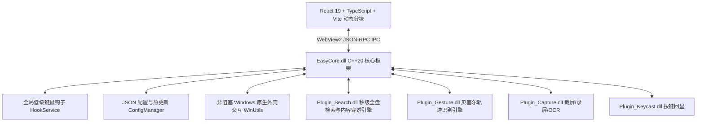

# 🚀 EasyTools 核心开发与架构交接文档 (Handover Document)

> **文档基准时间**：2026 年 8 月  
> **原作者与版权**：`Yy1 (yuan278501381)` / [GitHub 仓库](https://github.com/yuan278501381/easyTools)  
> **开源协议**：MIT License  
> **最新同步提交**：`fa63753` (已完全推送到 `origin/main`)

---

## 📌 一、 项目全景与技术拓扑

`EasyTools` 是一款面向 Windows 现代桌面端的高性能、极限轻量级系统级效率工具箱（包含**秒级全盘/内容检索、鼠标手势、按键回显、屏幕拾色/截图录屏/OCR、热键调度**等模块）。



### 1. 技术栈
* **核心后端 (Backend)**：C++20, MSVC (Visual Studio 2022/2026 v143+), Direct2D, COM/Shell API, Windows Hook API, NTFS USN/MFT 引擎, Lua 5.4;
* **前端渲染 (Frontend)**：React 19, TypeScript 5.x, Vite 8 (多 Entry 动态分块，通过 easytools.local 虚拟主机本地加载), Lucide-react 矢量图标, i18next;
* **混合架构 (Hybrid Shell)**：Microsoft Edge WebView2 (通过 `MessageBridge` 实现双向类型安全 JSON-RPC 通信);
* **安装与分发 (Packaging)**：Inno Setup 6 自动化脚本 (`deploy.ps1` 一键构建、测试、裁剪并生成安装包)。

---

## 🛠️ 二、 近期重点重构与已解决痛点清单

在此前的迭代中，系统完成了以下核心特性的升级与重构（均已合入 `main` 分支）：

### 1. 手势编辑器智能冲突覆盖 (`fa63753`)
* **痛点**：编辑或修改已有手势时，因编码与系统预设或其他动作冲突导致保存按钮被禁用（UX 反模式）。
* **方案**：将红色阻塞型报错升级为**非阻断式琥珀色智能提示**（`💡 手势「↓ →」当前已绑定到「关闭」，保存将自动替换原手势`），并在保存管线中实现自动去重与覆盖。

### 2. 搜索界面 Esc 失焦响应与 Shell 定位防崩溃 (`0aab2fa`)
* **Esc 失焦退出**：重构全局键盘分发器为捕获阶段监听（`handleUnifiedKeyDown` + `capture: true`），建立严密的 **Dismiss Stack**。无论焦点在输入框、分类标签还是列表空白处，按 `Esc` 均能逐层退场直至关闭；盲打任意字符自动聚焦回搜索框。
* **根治 AppHang 崩溃**：彻底废弃在 UI 线程同步调用 `ShellExecuteW(explorer.exe /select)`，封装 `WinUtils::openFolderAndSelectItem`，首选原生 `SHOpenFolderAndSelectItems` 并下沉到 Detached 后台工作线程，杜绝 Windows 资源管理器繁忙导致 UI 挂起崩溃。

### 3. 上帝视角全量扩展格式库与全面剔除 Emoji (`e2c3378`)
* **格式全覆盖**：扩充 `PlainTextExtractor.cpp` 与前端 `CONTENT_FORMAT_CATEGORIES`，覆盖现代开发（Zig, Nim, Odin, Rust, Go, TS）、数据架构（Proto, GraphQL, Thrift, Prisma, DBML）、企业脚本（AutoHotkey, PLD, CH）等数十种格式。
* **矢量图标升级**：彻底清空界面残留的系统 Emoji，全量升级为 Lucide 微边框矢量图标体系。

### 4. 搜索结果右键上下文菜单体系 (`501e3b8`, `d6193ec`, `e269d56`)
* 实现了 **Fluent 现代右键菜单**（打开/管理员运行/记事本/重命名/复制路径/文件属性）与 **Windows 原生外壳菜单** 双模支持。
* 修复了 Shift+右键原生菜单的焦点抢占与 UI 线程阻塞问题。

---

## 🚨 三、 核心架构规范与开发红线 (Strict Rules)

后续接手开发（如在 Cursor 中编写代码）时，必须严格遵守以下**世界级工程标准**：

### 1. C++ 动态链接库导出规范 (DLL Exports)
* 类若标记了 `EASYCORE_API` 或 `PLUGIN_EXPORTS`，**严禁**在头文件中完全内联实现非模板方法或静态单例！
* 必须将实现抽离到对应的 `.cpp` 文件中，严防跨 DLL 边界引发 `LNK2019` 未解析外部符号错误。

### 2. Windows 宏冲突防范
* Windows SDK 头文件定义了大量宏（如 `MOD_CTRL`, `MOD_ALT`, `MOD_SHIFT`, `MOD_WIN`）。
* 自定义枚举或常量时**严禁同名**，必须使用业务前缀（如 `MOUSE_MOD_`、`APP_MOD_`），防止引发 `C2059` 语法灾难。

### 3. 物理内存修剪规范 (`WinUtils::trimWorkingSet`)
* **触发原则**：必须且仅在**冷路径 / 生命周期终点**触发（如截图完成/取消、录屏结束、长截图拼接完成、OCR 结束、搜索窗口隐藏、插件停用）。
* **严格红线**：**严禁**在 1000Hz 鼠标钩子回调、键盘连击流或 60FPS 渲染循环等热路径中调用，防止软缺页（Soft Page Faults）造成微卡顿。

### 4. 质量门禁与回归型覆盖率标准
* 原生源码行覆盖率门禁当前为 **32%**，按已测基线逐步提高；项目不要求不可实现的全库 100% 语句/分支覆盖。
* 新增或修改的核心业务逻辑、工具算法、数据解析、安全边界与状态机必须配套聚焦的单元测试（`EasyToolsTests.exe`）。
* 坚决贯彻“零死代码（Zero-Dead-Code）”原则；平台、硬件与故障恢复分支应由测试或人工验证说明覆盖。
* 前端执行 `npm run lint` 与 `npm run i18n-check` 必须保持 **0 错误、0 警告**。

### 5. 跨架构与 DPI 适配
* 架构需原生支持 **x64** 与 **ARM64**；
* 前端/客户端需全面覆盖 High-DPI 与不同 Windows 缩放比例（100% ~ 250%）。

### 6. 搜索服务生命周期
* Windows 服务固定为 `DEMAND_START`；EasyTools 启动、后台 WebView 预载、设置页状态查询与主程序退出均不得启动它。
* 只有用户通过快捷键、托盘或设置页按钮显式打开搜索时才按需启动；首次唤起后服务跨搜索窗口和 EasyTools 进程常驻，直到 Windows 关机/重启或管理员显式停止。

---

## 💻 四、 常用构建、测试与部署指令

### 1. 前端开发与打包
```powershell
# 进入前端目录
cd ui

# 代码规范与 CSS 变量校验
npm run lint

# 多语言国际化键值对齐校验
npm run i18n-check

# 生产环境打包 (生成生产静态资源与分块到 ui/dist/)
npm run build
```

### 2. C++ 与整包一键自动化部署 (推荐)
根目录下提供了现代化的 PowerShell 自动化流水线脚本 `deploy.ps1`：
```powershell
# 快速构建（编译前端 + 编译 C++ 核心与全量插件 + 自动化测试 + 组装 deploy_dist，跳过 Inno Setup 生成）
pwsh -ExecutionPolicy Bypass -File .\deploy.ps1 -Quick -SkipInstaller

# 全量发版构建（包含 Inno Setup 完整安装包打包，输出至 Output/EasyTools-Setup.exe）
pwsh -ExecutionPolicy Bypass -File .\deploy.ps1

# 仅执行 C++ 单元测试套件
.\build\bin\Release\EasyToolsTests.exe
```

---

## 📂 五、 核心目录拓扑

```text
easyTools/
├── src/                         # C++ 后端源码
│   ├── core/                    # EasyCore 核心库
│   │   ├── ipc/                 # WebView2 MessageBridge 桥接层
│   │   ├── utils/               # WinUtils, TraceId 等系统工具
│   │   ├── hotkey/              # 全局热键与 Hook 调度
│   │   └── config/              # JSON 配置持久化与热更新
│   ├── search/                  # Plugin_Search 搜索插件与全盘检索服务客户端
│   ├── gesture/                 # Plugin_Gesture 鼠标手势插件
│   ├── capture/                 # Plugin_Capture 截图/录屏/OCR
│   ├── keycast/                 # Plugin_Keycast 按键回显
│   └── service/content/         # PlainTextExtractor 文档/代码内容提取器
├── ui/                          # React + Vite 前端源码
│   ├── src/
│   │   ├── components/          # UIKit, 手势画板, 快捷键录制器, 弹窗组件
│   │   ├── pages/               # 搜索页, 手势设置页, 拾色截图页, 系统设置页
│   │   ├── i18n/locales/        # 中英文多语言字典 (zh.json, en.json)
│   │   ├── SearchApp.tsx        # 独立搜索大窗主入口
│   │   └── App.tsx              # 主控制台/设置中心入口
│   └── vite.config.ts           # 前端 Vite 动态分块与开发服务器配置
├── tests/                       # Google Test 单元测试套件
├── deploy_dist/                 # 绿色便携版运行目录 (包含所有依赖 DLL 与资源)
├── deploy.ps1                   # 一键自动化 CI/CD 构建部署脚本
└── CMakeLists.txt               # CMake 根构建脚本
```

---

## 🎯 六、 推荐后续演进方向 (Roadmap)

1. **搜索性能极致优化**：
   * 进一步提升超大规模（50万+文件）全文搜索的流式加载与分页渲染性能；
   * 探索 DirectStorage / 多线程 SIMD 字符串匹配在本地纯文本扫描中的应用。
2. **手势扩展与动作生态**：
   * 丰富手势轮盘菜单（Radial Menu / Pie Menu）交互；
   * 支持多显示器跨屏手势穿透与特定窗口进程（Target App）规则的更细粒度配置。
3. **录屏与图像工具链增强**：
   * OCR 引擎支持离线轻量级 PaddleOCR / ONNX Runtime 本地模型嵌入；
   * 录屏支持硬件加速 NVENC / Intel QSV / AMD AMF 编码器动态探测。
