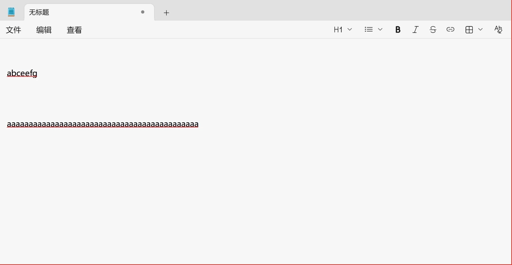
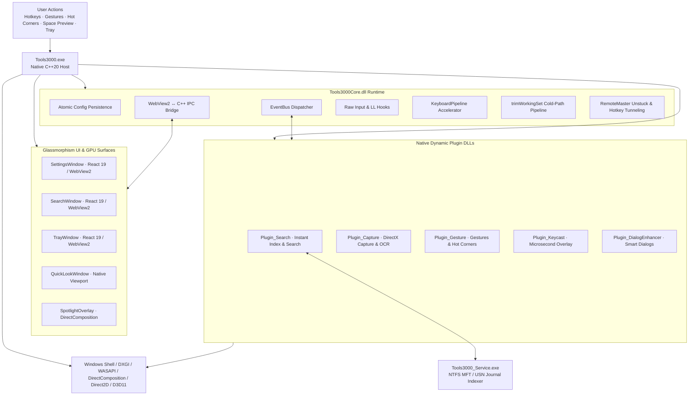

<div align="center">


# Tools3000

High-Performance Open-Source Productivity Suite for Windows 10/11 and Windows Server (v1.0.0 Official Release)

[简体中文](README.md) · [English](README.en.md)

[](https://github.com/yuan278501381/Tools3000/releases/latest)
[](LICENSE)
[](#system-requirements)
[](CMakeLists.txt)
[](ui/package.json)
[](ui/package.json)

</div>

Tools3000 is a **world-class, high-performance native desktop productivity toolkit** engineered specifically for Windows daily office work, creative design, software engineering, and power users. Say goodbye to bloated Electron runtimes, sluggish performance, and fragmented tools. Tools3000 deeply unifies **File Search, Mouse Gestures, Hot Corners, Screen Capture & Recording, Keycast Keystroke Overlay, Cursor Effects & Presentation, File Dialog Enhancer, and Remote Assistance Boost** into one rock-solid, ultra-lightweight suite.

---

## 🌟 Core Features at a Glance (In Client Navigation Order)

Every feature in Tools3000 is crafted around genuine user friction points and tangible everyday desktop experiences:

```
┌─────────────────────────────────────────────────────────────────────────────┐
│ 01. File Search            ➔ Alt+Space instant lookup, acronym & full-text  │
│ 02. Mouse Gestures         ➔ Right-click swipe: close, navigate & volume    │
│ 03. Hot Corners            ➔ Flick mouse to 4 screen corners: desktop & lock│
│ 04. Screen Capture & Record➔ Zero-blackout capture, self-healing pins & GIF │
│ 05. Keycast Overlay        ➔ Microsecond keycaps, intelligent typing silence│
│ 06. Cursor Effects & FX    ➔ Double-tap Ctrl spotlight, water ripple click  │
│ 07. File Dialog Enhancer   ➔ App-specific history, 1-click active path jump │
│ 08. Remote Assistance Boost➔ Hotkey tunneling, stuck key flush & auto ENG   │
└─────────────────────────────────────────────────────────────────────────────┘
```

---

## 💡 User-Centric Everyday Scenarios (Feature Deep Dive)

### 1. ⚡ File Search (Lightning Search)
> **"Looking for a 6-month-old spreadsheet while drafting a proposal? Tap a couple letters and it pops up in a blink."**

<p align="center">
  
</p>

- **Sub-Millisecond Response**: Press `Alt + Space` anytime from anywhere. Searches across millions of files in 1~3 milliseconds without lag;
- **Pinyin, Acronym & Wildcard Blind Search**: Type initials like `xshz` to find *2025Q3销售汇总.xlsx* instantly; press Enter to launch;
- **Deep Document Content Extraction**: Penetrates Word, Excel, PowerPoint, PDF, source code, and AutoCAD DXF text without opening them;
- **Instant Space Preview**: Hit `Space` to instantly preview documents, rendered markdown, syntax-highlighted code, or high-res images without waiting for heavy software to boot;
- **Conforms to DEMAND_START**: Consumes zero background CPU and disk reads when idle; tap `Esc` to dismiss and immediately release I/O resources.

---

### 2. 🖱️ Mouse Gestures
> **"Browsing dozens of pages? Stop moving your hand all the way to the top-left corner just to click back."**

<p align="center">
  
</p>

- **Effortless Navigation**: Hold the right mouse button and flick: an "L" shape immediately closes the active tab or window; swipe left to go back; swipe right to go forward; swipe down to minimize;
- **Taskbar & Desktop Wheel Gestures**: Hold right-click and scroll the wheel on the taskbar or desktop to switch virtual desktops or smoothly adjust audio volume;
- **Hand-Shake Angle Tolerance**: Built-in smoothing filter understands your gesture intent even with shaky hands and curved strokes.

---

### 3. 🖥️ Hot Corners
> **"Flick your mouse to any screen corner like a magic wand to return to desktop or instantly lock your PC."**

- **Zero-Cognitive Corner Flicking**: Simply fling your cursor into any of the 4 physical display corners (Top-Left, Top-Right, Bottom-Left, Bottom-Right) to trigger your chosen actions;
- **Essential Office Shortcuts**:
  - *Flick Top-Right* ➔ Instantly toggle desktop visibility (show/restore all windows);
  - *Flick Bottom-Left* ➔ Immediately lock the PC before leaving your desk, protecting privacy;
  - *Flick Top-Left* ➔ Open Windows Task View or Task Center to glance at all active projects;
- **Smart Anti-Jitter & Dwell Filter**: Specifically calibrated for office ergonomics—only triggers when deliberately pushed into a corner, never misfiring during casual fast mouse sweeps.

---

### 4. 📸 Screen Capture & Recording
> **"Zero blackout screen freeze, magnetic window snapping, self-healing markup numbers, and glow-bordered recording without blind anxiety."**

- **DirectX Zero-Blackout Capture**:
  - GPU-accelerated capture with automatic border snapping and shadow removal; scroll the wheel to penetrate overlapping windows;
  - Self-healing numbered badges (①②③) automatically renumber if a step is removed;
  - Pinned desktop windows with free zoom and opacity control;
  - Offline local OCR text extraction directly to clipboard with zero cloud leakage;
  - Smooth scrolling capture for long web pages and chat logs.
- **Glow-Border Recording & GIF Export**:
  - Hollow breathing border clearly indicates the active recording viewport, eliminating blind recording worries;
  - Floating control toolbar automatically avoids obstructing content;
  - Industrial-grade power-loss safe MP4 muxing guarantees uncorrupted files even upon abrupt power cuts;
  - 2-pass high-definition GIF export produces vibrant, noise-free animations for chat sharing.

---

### 5. ⌨️ Keycast Keystroke Overlay
> **"Teaching software or recording tutorials? Beautiful keycaps float in the corner while continuous typing stays completely silent."**

- **Glassmorphism Keycap Badges**: Hotkeys float on screen with smooth physics damping (e.g. `Ctrl + C`, showing `×3` for repeated presses);
- **Smart Shift-Symbol Folding**: `Shift + 8` automatically folds into a single clean `*` keycap without cluttered keystroke strings;
- **Intelligent Typing Silence**: Mutes automatically during continuous typing so it never distracts you, appearing only when real modifier shortcut combos are pressed;
- **100% Offline Local Privacy**: Keystroke statistics and heatmap analytics reside strictly in local memory and disk, never uploaded to any cloud.

---

### 6. 🪄 Cursor Effects & Presentation (Spotlight & FX)
> **"Presenting on a big screen or sharing your desktop in Teams/Zoom? Never have your audience squint to find your mouse."**

<p align="center">
  
</p>

- **Double-Tap Ctrl Spotlight**: Instantly dims the background while illuminating your mouse with a soft spotlight circle, centering audience focus;
- **Luminous Trails & Water Ripples**: Smooth particle motion trails accompany cursor movements; left clicks emit blue ripples, right clicks emit emerald ripples;
- **Focus-Assist Friendly**: Geometrically avoids triggering Windows Focus Assist (Do Not Disturb), fading out smoothly with zero flicker.

---

### 7. 📁 File Dialog Enhancer
> **"No more clicking through deep folder hierarchies over and over again in Windows Save/Open dialogs."**

- **1-Click Jump to Active Explorer Folder**: When a Save As dialog opens, a glass capsule appears displaying the folder currently open in File Explorer. One click jumps directly to it!
- **App-Specific Folder Memory**: Remembers work repositories for VS Code and downloads folders for your browser independently without crosstalk.

---

### 8. 🌐 Remote Assistance Boost
> **"Working remotely via AnyDesk, ToDesk, or mstsc? Hotkeys tunnel smoothly to the remote session, and stuck modifier keys are fixed in 1 click."**

- **Immersive Hotkey Tunneling**: Keys like `Alt + Tab`, `Win + E`, and `Win + R` pass directly to the remote PC rather than switching your local machine;
- **Stuck Modifier Key Emergency Flush**: Abrupt network lag causing stuck `Ctrl`, `Alt`, or `Shift` keys? Rapidly double-tap Right-`Ctrl` or press `Ctrl + Alt + Backspace` to immediately flush and release all stuck channels;
- **Smart English Keyboard Switching**: Automatically switches to an English keyboard layout (`ENG 0409`) when focusing into a remote terminal, preventing Chinese IME interruptions.

---

## 📊 Memory Consumption Benchmark

```
Physical Working Set RAM Comparison (Lower is Better):
┌─────────────────────────────────────────────────────────────────────────────┐
│ 🔴 Typical Electron Productivity Apps (300 MB ~ 800 MB)                    │
│    ██████████████████████████████████████████████████████████ 600 MB (Avg)  │
├─────────────────────────────────────────────────────────────────────────────┤
│ 🟡 Traditional C# / .NET Tools (120 MB ~ 200 MB)                            │
│    ████████████████ 160 MB                                                  │
├─────────────────────────────────────────────────────────────────────────────┤
│ 🟢 Tools3000 Active Running (All 8 core features & plugins active: 20 ~ 40 MB)│
│    ███ 28 MB                                                                │
├─────────────────────────────────────────────────────────────────────────────┤
│ ⚡ Tools3000 Idle Tray Standby (Only ~11 MB RAM, 0.0% CPU)                   │
│    █ 11 MB                                                                  │
└─────────────────────────────────────────────────────────────────────────────┘
```

- **Idle Tray Standby**: Only **`~11 MB`** RAM, with **`0.0%`** idle CPU overhead.
- **Active Full-Suite Concurrency**: Only **`20 MB ~ 40 MB`** physical memory.
- **Cold-Path Memory Trim (`trimWorkingSet`)**: Heavy tasks (screenshots, recordings, OCR) automatically trim temporary buffers within 0.5s, instantly returning memory to Windows.

---

## 🏗️ Hardcore Geek Tech Stack & Architecture



1. **Modern C++20 Microkernel**: Zero runtime overhead, strong type safety, no GC stalls;
2. **Win32 Input Pipeline**: `WH_KEYBOARD_LL`, `WH_MOUSE_LL`, and Raw Input; `KeyboardPipeline` blocks menu stealing and Chromium shortcut conflicts;
3. **GPU Hardware Accelerated Rendering**: DirectComposition, Direct2D, DirectWrite, Direct3D 11; 100~300px local compact viewports and 256-stage LUT 0-sqrt multi-ripple halos;
4. **WebView2 Decoupling & Auto-Suspend**: React 19 + TypeScript modern frontend; freezes JS heap via `TrySuspend()` and recycles renderer processes after 60s idle;
5. **Microkernel Dynamic Plugins**: Modular C++ DLLs (`Plugin_*.dll`) communicating over `Tools3000Core` EventBus;
6. **Trusted Local Lua Automation**: Embedded Lua engine for user scripting and desktop automation;
7. **Native x64 & ARM64 Cross-Architecture**: Native builds for Intel/AMD x64 and Snapdragon/Surface ARM64 devices.

---

<a id="system-requirements"></a>
## 💻 System Requirements

- **OS**: Windows 10 (1809+) / Windows 11 / Windows Server 2019 / 2022 / 2025
- **Architecture**: **x64** and **ARM64**
- **Runtime**: Microsoft Edge WebView2 Runtime (pre-installed on most modern Windows systems)
- **Graphics**: DirectX 11 / Direct2D compatible GPU

---

## 📥 Download & Assets

| File | Platform | Description |
| :--- | :--- | :--- |
| **`Tools3000-Setup.exe`** | Windows 10/11/Server (x64) | Official Recommended Signed Installer |
| **`Tools3000-v1.0.0-Setup.exe`** | Windows 10/11/Server (x64) | Version-Tagged Official Installer Archive |
| **`Tools3000-v1.0.0-win-x64-portable.zip`** | Windows 10/11/Server (x64) | Green Portable Archive (extract and run) |
| **`SHA256SUMS.txt`** | All Assets | SHA-256 Checksum Verification Manifest |

---

## 📄 License & Attribution

Licensed under the **[MIT License](LICENSE)**.

* **Author**: **`Yy1 (yuan278501381)`** (GitHub: [@yuan278501381](https://github.com/yuan278501381))
* **Repository**: [https://github.com/yuan278501381/Tools3000](https://github.com/yuan278501381/Tools3000)
* **Copyright**: `Copyright (c) 2026 Yy1 (yuan278501381) & Tools3000 contributors`
