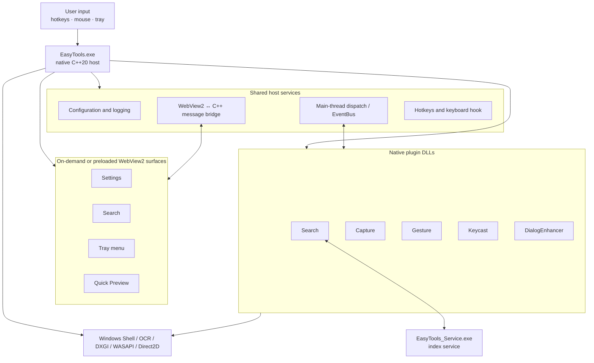

<div align="center">


# EasyTools

An open-source productivity toolkit for Windows

[简体中文](README.md) · [English](README.en.md)

[](https://github.com/yuan278501381/easyTools/releases/latest)
[](LICENSE)
[](#system-requirements)
[](CMakeLists.txt)

</div>

EasyTools brings mouse gestures, screen capture and recording, local file search, file-dialog enhancements, OCR, keystroke visualization, and quick preview into one Windows application. It uses a native C++20 core with a React, TypeScript, and WebView2 interface and is under active development.

This document describes only capabilities that can be verified in the current repository and released builds. Behavior may vary with the Windows version, hardware, drivers, target application, and configuration.

## Features

| Feature | Current capabilities | Scope and notes |
| --- | --- | --- |
| File dialog assistant | Remembers recent folders per originating application; offers recent folders, workspaces, and the current File Explorer folder | Designed for common Windows open, save, and folder-selection dialogs; custom-drawn or non-standard dialogs may not be supported |
| Local file search | NTFS MFT/USN indexing; pinyin, wildcard, regex, path, parent-folder, extension, file/folder, and exclusion filters | Fast MFT indexing primarily applies to local NTFS volumes; network locations, ReFS, and other file systems do not have the same capability |
| File content search | Plain text, common source and configuration files; Office Open XML/WPS/XMind documents; PSD/PSB/AI metadata; DXF text | Full-text extraction is not available for every format; encrypted, damaged, or very large files may be skipped |
| Mouse gestures | Configurable trigger buttons, direction sequences, application scopes, shortcuts, built-in actions, program launch, and Lua actions; also hot corners and a radial menu | Global hooks can conflict with other gesture, input, or security software and can be adjusted in Settings |
| Capture and pin | Region capture, annotation, scrolling capture, OCR, and always-on-top image pins | Scrolling capture depends on how the target window scrolls and renders |
| Screen recording | MP4 H.264/H.265, WebM VP9, and GIF; optional system audio, microphone, cursor, and click effects | Available codecs and performance depend on system components, GPU, drivers, and selected settings |
| OCR | Uses the local Windows OCR engine and installed system language packs | Languages and recognition quality depend on installed packs, image clarity, and layout |
| Keystroke display | On-screen keyboard/mouse input display and usage statistics | Consider pausing it while entering sensitive information such as passwords |
| Quick preview | Select an item in File Explorer or on the desktop and press Space to preview folders, Markdown, images, audio/video, PDF, code, text, and more | Large or unsupported binary files receive a limited preview or file-information view |

These capabilities are delivered by the EasyTools host and five native plugins: Search, Capture, Gesture, Keycast, and DialogEnhancer. Shared features such as Quick Preview are provided by the host.

## Screenshots

<p align="center">
  
</p>
<p align="center"><sub>Tray quick menu for module status and common actions.</sub></p>

<p align="center">
  
</p>
<p align="center"><sub>General settings for startup behavior, interface language, theme, and logging.</sub></p>

<p align="center">
  
</p>
<p align="center"><sub>Shortcut overview showing current bindings, activation scope, and conflict detection.</sub></p>

<table>
  <tr>
    <td width="50%" align="center"><br /><sub>Modules: plugin versions, capabilities, status, and enablement.</sub></td>
    <td width="50%" align="center"><br /><sub>Mouse gestures: switches, trail appearance, and application behavior.</sub></td>
  </tr>
  <tr>
    <td width="50%" align="center"><br /><sub>Gesture actions organized by global, application, and special-target scope.</sub></td>
    <td width="50%" align="center"><br /><sub>Local activity trends and a keyboard heatmap.</sub></td>
  </tr>
</table>

<p align="center">
  
</p>
<p align="center"><sub>Content search with matching excerpts, file properties, density controls, and search modes.</sub></p>

These are user-provided screenshots of the actual EasyTools v1.0.1 interface. The UI is evolving quickly and may differ slightly between builds; see [Releases](https://github.com/yuan278501381/easyTools/releases) for version-specific notes. The screenshots use the Chinese UI; EasyTools also provides an English interface option.

## Download and use

1. Download the latest installer or portable package from [GitHub Releases](https://github.com/yuan278501381/easyTools/releases/latest).
2. The installer requires administrator privileges to install the background component used by features such as fast file indexing. Some system-level features may be limited in the portable build.
3. Start EasyTools, then open Settings from the system tray and enable the features you want.

The default search shortcut is `Alt+Space`. For capture, recording, OCR, pinning, and other shortcuts, use the values shown in Settings. EasyTools reports shortcut conflicts it can detect.

## System requirements

- Windows 10 or Windows 11, x64
- Microsoft Edge WebView2 Runtime (already present on most supported Windows installations)
- Some features require administrator privileges, NTFS, Windows OCR language packs, or an available media encoder

There are currently no macOS, Linux, or ARM64 builds.

## Known limitations

- The File Dialog Assistant targets standard Windows Shell file dialogs. Custom pickers and sandboxed applications are not guaranteed to work.
- Mixed-DPI and multi-monitor behavior, scrolling capture, and hardware encoding can vary with the target application, graphics driver, and Windows version.
- The fast MFT/USN search path is designed for NTFS. Other locations use different capabilities or may not support equivalent indexing.
- Content search is implemented format by format and should not be read as universal full-text search.
- This is an actively developed project. Back up important configuration before upgrading, and include the version, reproduction steps, and logs in issue reports.

## Privacy and network access

Search indexing, OCR, capture, recording, and configuration are processed locally by default. EasyTools does not require an account and does not upload file contents to provide these core features.

The update checker contacts the GitHub Releases API. Links opened explicitly by the user may also access the corresponding sites. Third-party scripts, user-configured external programs, and future extensions may have their own network behavior and should be reviewed separately.

## Build from source

Recommended prerequisites:

- Visual Studio 2022 or newer with **Desktop development with C++**
- CMake 3.25+
- PowerShell 7+
- Node.js 24+
- vcpkg (the default path is `C:\vcpkg`; it can also be supplied through build parameters)
- Inno Setup 6 (only required to create the installer)

Run from the repository root:

```powershell
pwsh -NoProfile -File .\deploy.ps1 -Configuration Release
```

Primary outputs are written to `build/bin/Release` and `deploy_dist`. If Inno Setup is detected, the installer is created in `Output`. Run `Get-Help .\deploy.ps1 -Detailed` for available parameters.

The product version is maintained only in the root [`VERSION`](VERSION) file. See [Versioning](docs/versioning.md) for details.

## Architecture and lifecycle

### System architecture



The plugin manager reads and validates manifests first. It maps a DLL only when that plugin is enabled and compatible at process start. Changing a plugin switch in Settings requires an EasyTools restart before the loaded set changes.

### UI and memory lifecycle

```mermaid
stateDiagram-v2
    [*] --> Starting
    Starting --> Resident: Initialize host, tray, and enabled plugins
    Resident --> UIActive: Open Settings or Search
    UIActive --> UIHidden: Hide window and request TrySuspend
    UIHidden --> UIActive: Resume and reuse the existing window
    Resident --> TrayActive: Open the preloaded tray menu
    TrayActive --> Resident: Hide tray menu and trim the working set
    Resident --> HeavyTask: Capture, scrolling capture, or pinning
    HeavyTask --> Resident: Destroy task resources; trim working set on selected cold paths
    UIActive --> ShuttingDown
    UIHidden --> ShuttingDown
    Resident --> ShuttingDown
    ShuttingDown --> [*]: Destroy WebViews, stop plugins, clear callbacks, unload DLLs
```



`TrySuspend` is a best-effort WebView2 request and the runtime may refuse it. The current code requests a working-set trim when the tray menu is hidden, the file-dialog ribbon is destroyed, scrolling capture shuts down, and the last or all pinned images are closed. A trim is only a request to the Windows memory manager; it does not guarantee immediate release of all memory, so this README does not promise a fixed resident footprint.

### Plugin startup and shutdown sequence

```mermaid
sequenceDiagram
    participant App as EasyTools host
    participant Config as ConfigManager
    participant PM as PluginManager
    participant Manifest as Plugin manifest
    participant DLL as Plugin DLL
    participant Core as EventBus / IPC / Hotkey
    participant UI as WebView surfaces

    App->>Config: Read configuration
    App->>PM: Scan plugin directory
    PM->>Manifest: Validate version, ABI, entry point, and permissions
    alt Plugin disabled or manifest incompatible
        PM-->>App: Record status without mapping the DLL
    else Plugin allowed at startup
        PM->>DLL: LoadLibrary + ABI handshake + CreatePlugin
        App->>Core: Initialize shared services and handlers
        App->>PM: initializePlugins()
        PM->>DLL: initialize()
    end
    App->>UI: Preload tray; create other windows on demand or by configuration
    Note over App,UI: Normal operation
    App->>UI: Destroy WebView entry points first
    App->>PM: shutdownPlugins()
    PM->>DLL: Call shutdown() in reverse order
    PM->>Core: Drain main-thread work and clear callbacks/handlers
    PM->>DLL: FreeLibrary
```

These diagrams describe the current [`main.cpp`](src/main.cpp), [`PluginManager.cpp`](src/core/plugin/PluginManager.cpp), [`WebViewSuspend.cpp`](src/ui/WebViewSuspend.cpp), and [`WinUtils.h`](src/core/utils/WinUtils.h), rather than a proposed future architecture.

Development documentation:

- [Plugin development guide](docs/plugin-development.md)
- [Lua API](docs/api/lua-api.md)
- [Performance baseline](docs/performance-baseline.md)
- [Versioning](docs/versioning.md)

## Contributing

Issues and pull requests are welcome. When reporting a problem, include the EasyTools version, Windows version, reproduction steps, expected and actual results, and relevant logs with private information removed. For compatibility issues, also identify the target application and file-dialog type.

## License

EasyTools is released under the [MIT License](LICENSE). Third-party components remain subject to their respective licenses.
