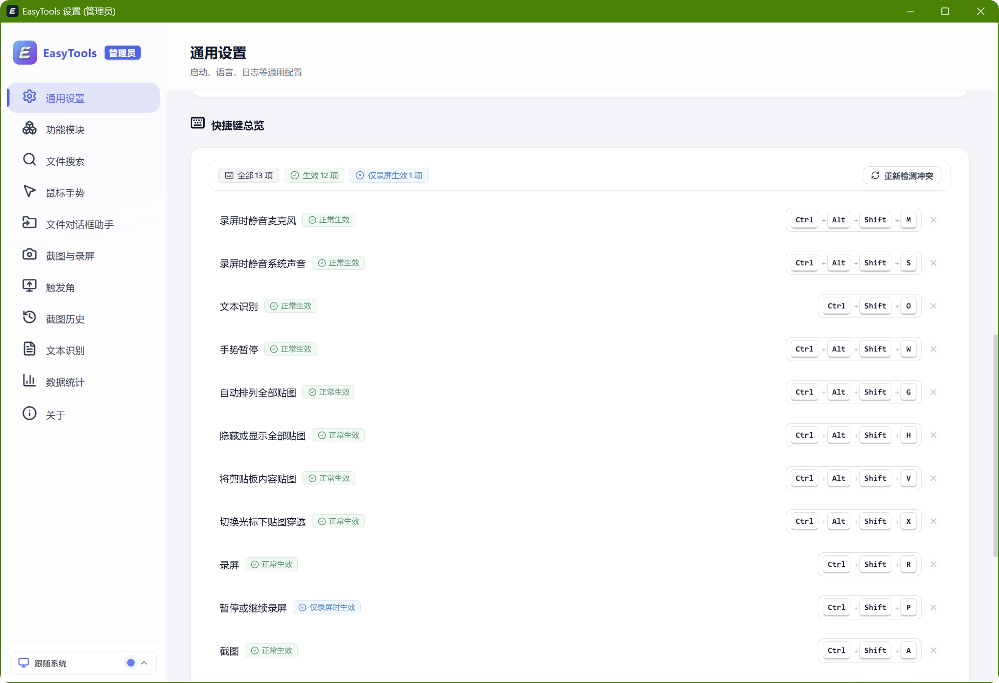
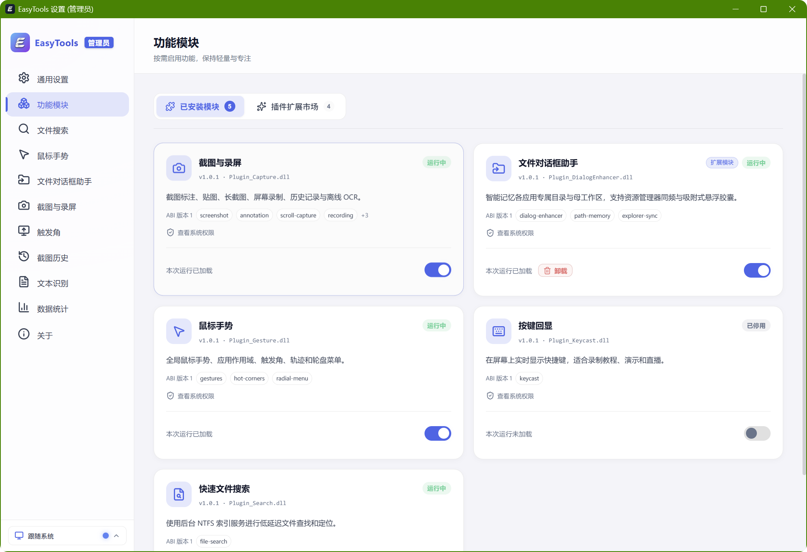
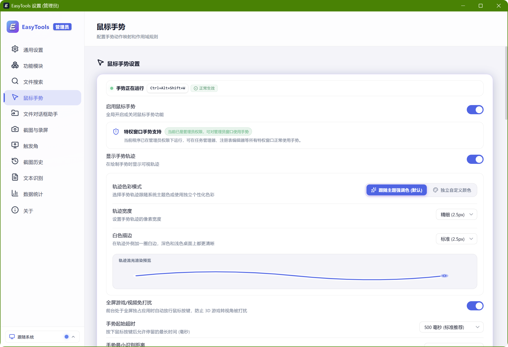
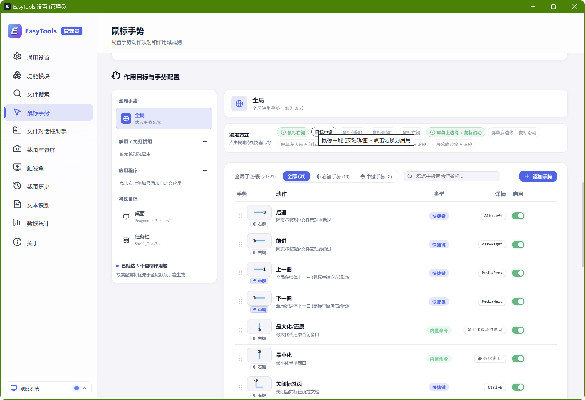
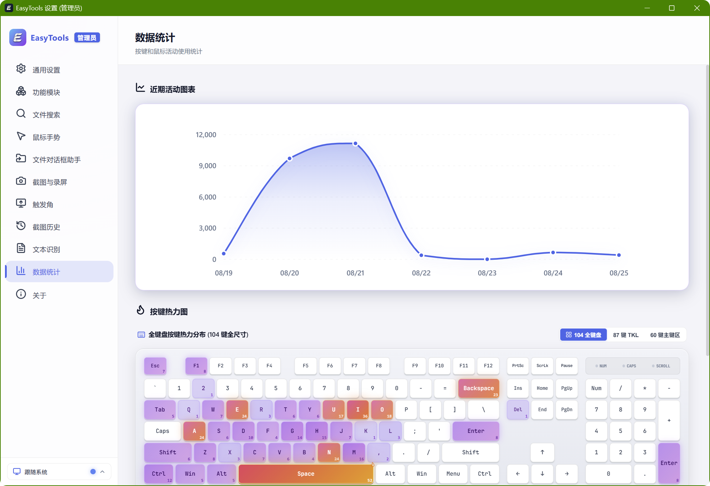
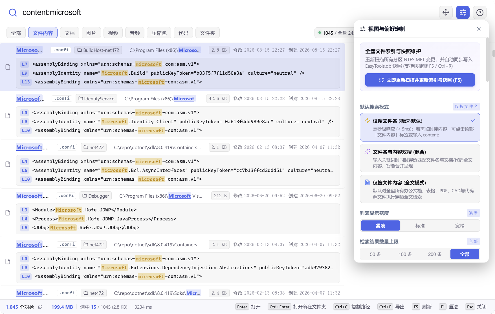
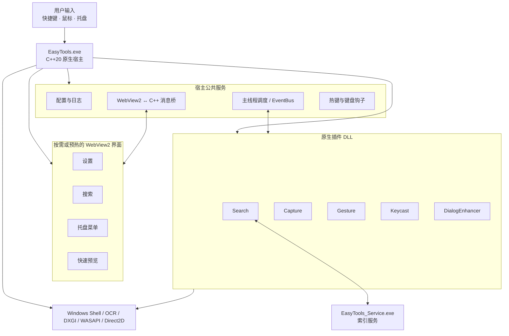
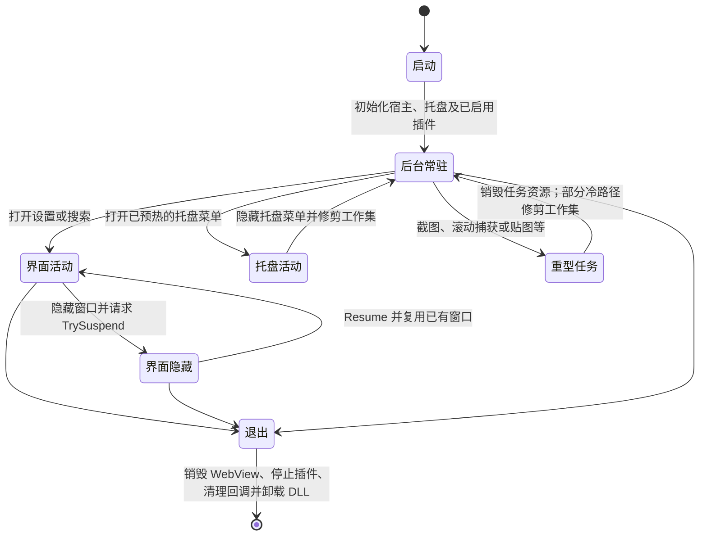
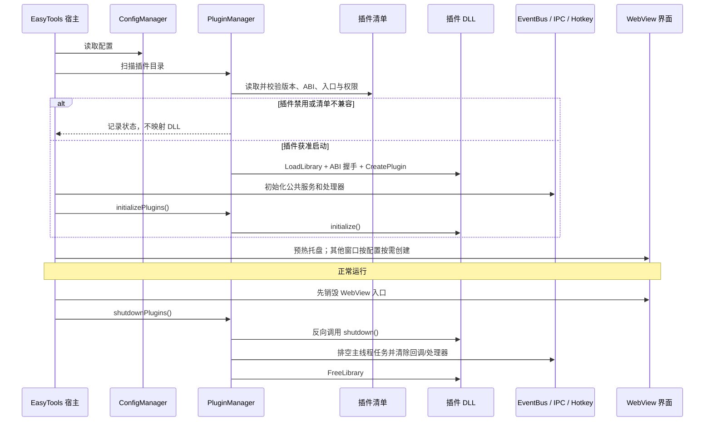

<div align="center">


# EasyTools

面向 Windows 的开源桌面效率工具集

[简体中文](README.md) · [English](README.en.md)

[](https://github.com/yuan278501381/easyTools/releases/latest)
[](LICENSE)
[](#系统要求)
[](CMakeLists.txt)

</div>

EasyTools 把鼠标手势、截图与录屏、本地文件搜索、文件对话框增强、OCR、按键显示和快速预览放进一个 Windows 应用中。项目采用 C++20 原生核心与 React、TypeScript、WebView2 界面，目前仍在持续开发。

本文只描述当前仓库和已发布版本中能够核实的功能。实际体验可能因 Windows 版本、硬件、驱动、目标应用及设置不同而变化。

## 功能概览

| 功能 | 当前能力 | 适用范围与说明 |
| --- | --- | --- |
| 文件对话框助手 | 按发起程序记忆最近目录；提供最近目录、工作区和资源管理器当前目录的快捷入口 | 面向常见的 Windows 打开、保存和选择文件夹对话框；采用自绘或非标准对话框的应用可能无法增强 |
| 本地文件搜索 | NTFS MFT/USN 索引；支持拼音、通配符、正则、路径、父目录、扩展名、文件/文件夹及排除条件 | MFT 快速索引主要适用于本机 NTFS 卷；网络位置、ReFS 和其他文件系统不具备相同能力 |
| 文件内容搜索 | 纯文本、常见代码与配置文件；Office Open XML/WPS/XMind 文档；PSD/PSB/AI 元数据；DXF 文本 | 不是所有格式都支持正文提取；加密、损坏或超大文件可能跳过 |
| 鼠标手势 | 触发键、方向序列、应用范围、快捷键、内置动作、启动程序及 Lua 动作；另有热角和径向菜单 | 全局钩子可能与其他手势、键鼠或安全软件冲突，可在设置中调整 |
| 截图与贴图 | 区域截图、标注、滚动截图、OCR 与置顶贴图 | 滚动截图效果取决于目标窗口的滚动与绘制方式 |
| 屏幕录制 | MP4 H.264/H.265、WebM VP9、GIF；可选系统声音、麦克风、光标及点击效果 | 可用编码器和性能取决于系统组件、显卡、驱动和所选参数 |
| OCR | 调用 Windows 本地 OCR，并使用系统已安装的语言包 | 识别语言与质量取决于语言包、图像清晰度和版面 |
| 按键显示 | 在屏幕上显示键盘/鼠标输入，并提供使用统计 | 密码等敏感输入场景建议暂停该功能 |
| 快速预览 | 在资源管理器或桌面选中文件后按空格预览文件夹、Markdown、图片、音视频、PDF、代码及文本等 | 大文件和不支持的二进制格式会采用受限预览或文件信息视图 |

上述能力由 EasyTools 主程序和五个原生插件组成：搜索、截图录屏、鼠标手势、按键显示、文件对话框增强。快速预览等公共能力由主程序提供。

## 截图

<p align="center">
  
</p>
<p align="center"><sub>托盘快捷菜单：查看模块状态并快速进入常用功能。</sub></p>

<p align="center">
  
</p>
<p align="center"><sub>通用设置：启动方式、界面语言、主题和日志等选项。</sub></p>

<p align="center">
  
</p>
<p align="center"><sub>快捷键总览：集中查看当前绑定、生效范围及冲突检测结果。</sub></p>

<table>
  <tr>
    <td width="50%" align="center"><br /><sub>功能模块：查看插件版本、能力、状态和启停选项。</sub></td>
    <td width="50%" align="center"><br /><sub>鼠标手势：开关、轨迹样式和适用场景。</sub></td>
  </tr>
  <tr>
    <td width="50%" align="center"><br /><sub>手势动作：按全局、应用和特殊目标配置规则。</sub></td>
    <td width="50%" align="center"><br /><sub>本地统计：近期活动趋势和按键热力图。</sub></td>
  </tr>
</table>

<p align="center">
  
</p>
<p align="center"><sub>内容搜索：匹配片段、文件属性、显示密度和搜索模式设置。</sub></p>

以上为用户提供的 EasyTools v1.0.1 实际界面截图。界面仍在快速迭代，发布包中的实际界面可能略有差异；建议在 [Releases](https://github.com/yuan278501381/easyTools/releases) 查看对应版本说明。

## 下载与使用

1. 从 [GitHub Releases](https://github.com/yuan278501381/easyTools/releases/latest) 下载最新安装包或便携包。
2. 安装版需要管理员权限，以安装为快速文件索引等能力服务的后台组件；便携版的部分系统级能力可能受限。
3. 启动 EasyTools 后，通过系统托盘进入设置并按需启用功能。

默认搜索快捷键是 `Alt+Space`。截图、录屏、OCR、贴图等快捷键请以设置页面显示为准；EasyTools 会提示已检测到的快捷键冲突。

## 系统要求

- Windows 10 或 Windows 11，x64
- Microsoft Edge WebView2 Runtime（多数受支持的 Windows 系统已安装）
- 部分能力需要管理员权限、NTFS 文件系统、Windows OCR 语言包或可用的媒体编码器

当前没有 macOS、Linux 或 ARM64 版本。

## 已知边界

- 文件对话框助手针对标准 Windows Shell 文件对话框设计，自绘选择器或沙箱应用不保证兼容。
- 不同 DPI、多显示器、滚动截图和硬件编码行为会受目标应用、显卡驱动及 Windows 版本影响。
- 搜索的高速 MFT/USN 路径针对 NTFS；其他位置会采用不同能力或无法建立同等索引。
- 内容搜索是按格式逐步支持的，不应理解为对任意文档全文检索。
- 项目处于活跃开发期。升级前建议备份重要配置，并在 Issue 中附上版本、复现步骤和日志。

## 隐私与网络

搜索索引、OCR、截图、录屏和配置默认在本机处理。EasyTools 不需要账户，也不会为了实现这些核心功能上传文件内容。

应用的更新检查会访问 GitHub Releases API；用户主动打开项目、下载或反馈链接时，也会访问相应网站。第三方脚本、用户配置的外部程序及未来扩展可能有自己的网络行为，请单独审查。

## 从源码构建

建议准备：

- Visual Studio 2022 或更新版本，并安装“使用 C++ 的桌面开发”
- CMake 3.25+
- PowerShell 7+
- Node.js 24+
- vcpkg（默认路径为 `C:\vcpkg`，也可通过构建参数指定）
- Inno Setup 6（只在生成安装包时需要）

在仓库根目录执行：

```powershell
pwsh -NoProfile -File .\deploy.ps1 -Configuration Release
```

主要产物位于 `build/bin/Release` 和 `deploy_dist`；安装包在检测到 Inno Setup 后生成到 `Output`。具体参数请运行 `Get-Help .\deploy.ps1 -Detailed`。

产品版本只在仓库根目录的 [`VERSION`](VERSION) 中维护，详细规则见[版本管理说明](docs/versioning.md)。

## 架构与生命周期

### 总体架构



插件管理器先读取并校验清单，只为本次启动时启用且兼容的插件映射 DLL。设置中改变插件开关后，需要重启 EasyTools 才会改变实际装载状态。

### 界面与内存生命周期



这里的 `TrySuspend` 是 WebView2 提供的尽力请求，运行时可以拒绝。当前代码会在托盘菜单隐藏、文件对话框胶囊销毁、滚动捕获关闭，以及最后一个或全部贴图关闭等位置请求修剪工作集。修剪只是向 Windows 内存管理器发出请求，不代表系统会立即释放全部内存，README 因此不承诺固定常驻占用。

### 插件启动与退出时序



图示对应当前的 [`main.cpp`](src/main.cpp)、[`PluginManager.cpp`](src/core/plugin/PluginManager.cpp)、[`WebViewSuspend.cpp`](src/ui/WebViewSuspend.cpp) 和 [`WinUtils.h`](src/core/utils/WinUtils.h)，不是未来架构设想。

扩展开发请参阅：

- [插件开发指南](docs/plugin-development.md)
- [Lua API](docs/api/lua-api.md)
- [性能基线](docs/performance-baseline.md)
- [版本管理](docs/versioning.md)

## 参与贡献

欢迎提交 Issue 和 Pull Request。报告问题时，请提供 EasyTools 版本、Windows 版本、复现步骤、预期与实际结果，以及删除隐私信息后的相关日志。涉及兼容性的问题，最好同时说明目标程序和文件对话框类型。

## 许可证

EasyTools 采用 [MIT License](LICENSE) 发布。项目使用的第三方组件仍分别受其各自许可证约束。
