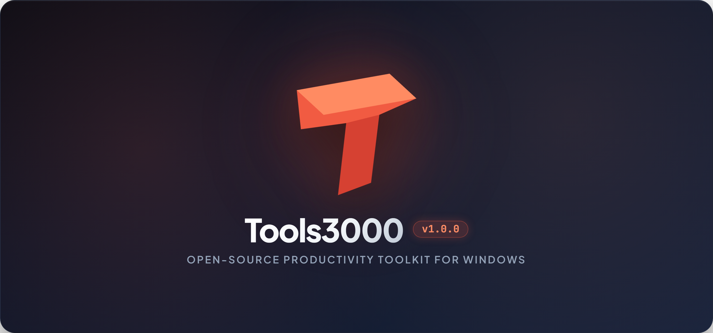
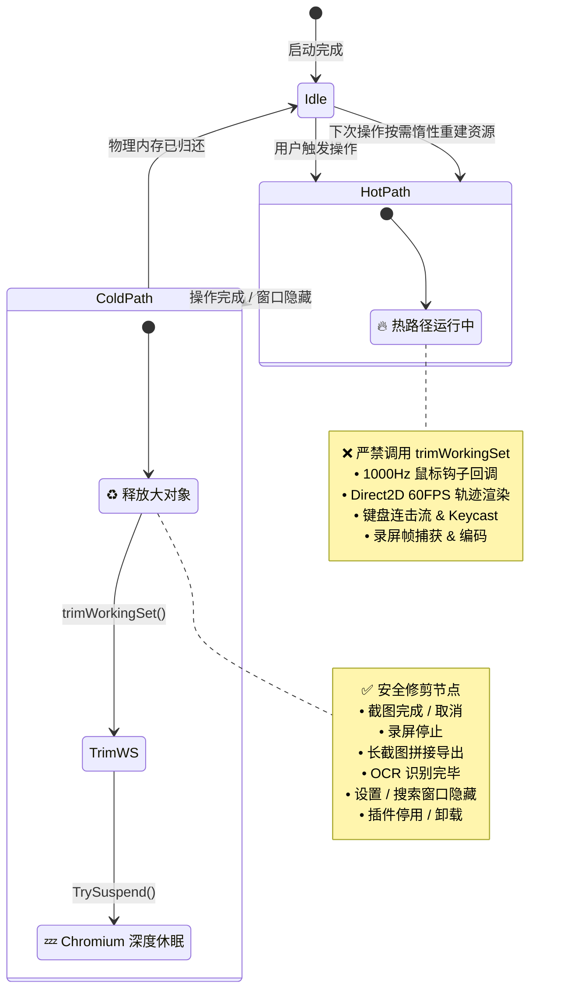
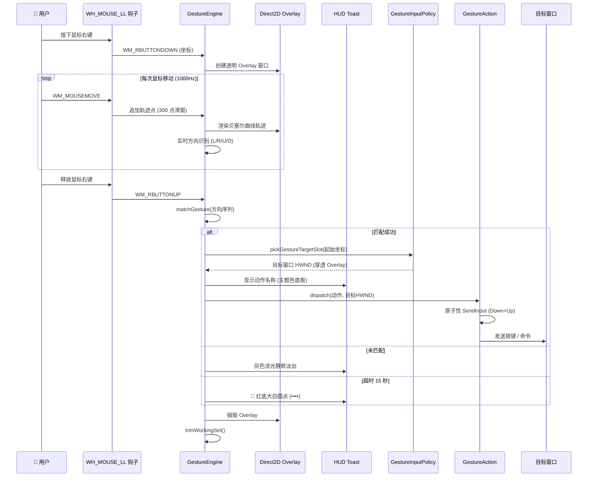
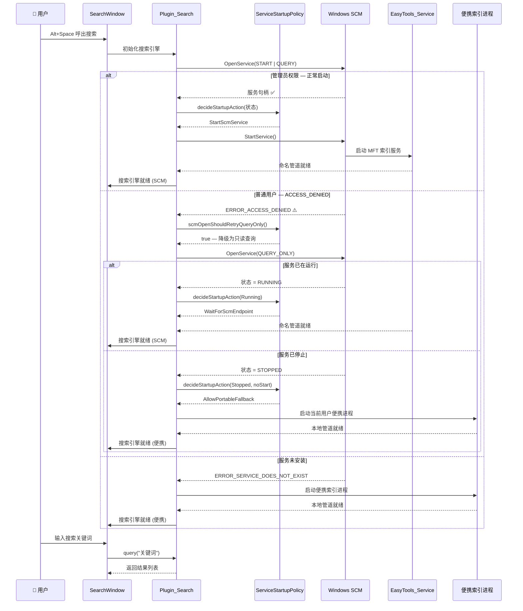

<div align="center">

<a href="https://github.com/yuan278501381/easyTools">
  
</a>

<br/>
<br/>

[](https://github.com/yuan278501381/easyTools/releases/latest)
[](LICENSE)
[](https://en.cppreference.com/w/cpp/20)
[](https://learn.microsoft.com/en-us/windows/win32/direct2d/direct2d-portal)
[](https://react.dev/)
[-0078D6.svg?logo=windows)](https://www.microsoft.com/windows)
[](#-代码覆盖率与质量门禁)
[](https://github.com/yuan278501381/easyTools/actions)

<p align="center">
  <strong>一款追求低干扰交互、可靠响应与 High-DPI 体验的 Windows 现代化桌面效率工具集</strong>
</p>

[🚀 快速开始](#-快速开始-quick-start) • [✨ 全功能特性详解](#-全功能特性详解) • [⌨️ 快捷键与手势速查](#-快捷键与手势速查) • [🏗️ 架构与内存收缩体系](#-架构与极致内存收缩体系) • [🛠️ 源码构建与开发](#-从源码构建与开发) • [📄 开源协议与署名](#-开源许可证与作者署名)

</div>

---

## 📖 项目简介

**EasyTools** 是一款专为开发者、设计师、极客与追求极致操作效率的 Windows 用户量身打造的现代化效率软件。

项目采用 **C++20 原生内核 + Direct2D / DXGI / WASAPI** 与 **React 19 + TypeScript + WebView2** 的现代化混合架构，结合原生系统能力、现代前端界面和 Per-Monitor DPI 适配。具体性能与资源占用会随硬件、Windows 版本和启用插件而变化，应以基准结果为准。

### 🌟 核心设计原则
1. **🚀 极限性能 (Extreme Performance)**：低开销鼠标钩子、Direct2D 轨迹渲染、DXGI 桌面捕获与硬件编码器优先的 4K 录屏、NTFS MFT 快速全盘搜索；
2. **💡 以人为中心的易用性 (Human-Centered UX)**：提供 HUD 视觉反馈、手势操作、上下文按键提示与 High-DPI 缩放适配，并持续依据可访问性和用户反馈改进；
3. **🧠 极限轻量与物理内存收缩 (Memory Trim & Deep Sleep)**：遵循“冷路径退场修剪，热操作期间绝不修剪”原则，重型任务结束后自动释放物理工作集，闲置时自动挂起 Chromium 渲染管线；
4. **🛡️ 可持续质量门禁**：Release 构建可使用 OpenCppCoverage 生成当前工作树的 C++ 行覆盖率；覆盖率会随编译器、构建配置和测试集变化，发布前应以 CI 归档的 Cobertura 报告为准。CI 设有 30% 的最低防回退门槛，并持续提高关键生命周期、录屏与捕获路径覆盖率。

---

## 🚀 快速开始 (Quick Start)

### 方式一：下载开箱即用（推荐）

1. 前往 **[Releases 官方发行版页面](https://github.com/yuan278501381/easyTools/releases)** 下载最新版本：
   - **安装版**：`EasyTools-Setup.exe`（支持静默安装、右键菜单集成与文件索引服务自注册）；
   - **绿色便携版**：`EasyTools-win-x64-portable.zip`（解压即可双击 `EasyTools.exe` 运行，数据就地保存）；
2. 启动后程序常驻系统托盘，所有功能即刻生效。

### 方式二：从源码一键构建

```powershell
# 1. 克隆代码仓库
git clone https://github.com/yuan278501381/easyTools.git
cd easyTools

# 2. 运行一键构建与测试门禁流水线
pwsh -ExecutionPolicy Bypass -File .\deploy.ps1 -Configuration Release

# 3. 产物将自动生成于 deploy_dist/ 目录及 Output/EasyTools-Setup.exe
```

---

## ✨ 全功能特性详解

### 1. 🖱️ 智能鼠标手势引擎 (Smart Mouse Gestures)
> **告别繁琐按键，一划即达。**

- **Direct2D 鼠标轨迹**：按住鼠标右键（或自定义触发键）在屏幕任意位置绘制，轨迹提供低干扰的视觉跟随；实际延迟以性能基准为准；
- **全新大气 HUD 视觉规范**：粗圆角纯白边框（2.6px）、半透明石墨深灰底板、24px 大气醒目粗体排版，松手执行时底板自然点亮为当前全局主题色；
- **300 点滑窗缓冲**：限制轨迹缓存规模并避免无界内存增长；不同设备上的帧耗时和流畅度需通过性能基准验证；
- **调侃超时反馈机制**：画满 15 秒未松手时常驻展示红底 3 个饱满圆滑大白点（`••••`），直到用户主动松手才优雅淡出；普通未匹配手势保持灰色流光且 Toast 静默；
- **原子性按键分发系统**：按下与释放单次系统调用原子提交，杜绝修饰键（Ctrl/Alt/Win）残留粘滞与幽灵按键叠加；
- **多维度动作库**：支持导航（前进/后退/刷新）、标签页控制（新建/关闭/恢复/切换）、窗口管理（最大化/最小化/还原/关闭窗口/显示桌面/任务视图）、启动截图、运行外部程序及执行自定义 Lua 脚本；
- **交互式手势编辑器**：内置可视化手势绘制录入画布，支持方向灵敏度阈值精细微调。

---

### 2. 🪟 屏幕热角与径向轮盘菜单 (Hot Corners & Radial Pie Menu)
> **利用屏幕边缘与肌肉记忆的高效操作。**

- **四角热区触发 (Hot Corners)**：光标轻推屏幕左上、左下、右上、右下四角，即刻触发预设动作（锁屏、截图、静音、桌面、任务切换），支持设置防误触停留延时；
- **呼出式径向轮盘 (Pie Menu)**：通过快捷键或鼠标按键在光标所在位置呼出扇形轮盘，环形分布常用工具，支持自定义图标、颜色与多层级扇区。

---

### 3. 📸 智能屏幕截图与桌面置顶贴图 (Capture & Desktop Pin)
> **面向多屏 DPI 的截图标注与灵活贴图。**

- **多显示器与 High-DPI 适配**：支持 100%～500% 缩放和混合 DPI 场景；跨屏捕获、光标与选区对齐仍需在目标设备组合上验证；
- **窗口与元素智能吸附**：自动探测窗口边界、菜单控件、对话框元素，一键吸附选中；
- **像素级专业标注工具箱**：矩形、圆形、箭头、自由画笔、马赛克/高斯模糊、序号步骤球、荧光笔、自定义文字与实时屏幕取色器；
- **桌面置顶贴图 (Pin)**：将截图或剪贴板图片/文字瞬间钉在桌面最上层，支持滚轮缩放、透明度调节、拖拽移动与快速保存，对照写代码、比对文档极度便捷；
- **新手友好提示**：左下角常驻上下文快捷键提示条，随手即可按 <kbd>H</kbd> 键隐藏，绝不污染截图输出。

---

### 4. 📜 智能滚动长截图 (Scroll Capture)
> **超长网页、长代码、长聊天记录一键完整捕获。**

- **智能视觉特征拼接算法**：自动向下滚动并基于重叠区域进行亚像素级特征匹配，无缝拼接超长画面，杜绝画面错位与重影；
- **全功能无级缩放预览**：拼接完成后支持自由缩放查看细节，支持二次裁剪、画笔标注并快速导出为 PNG / JPEG / WebP / PDF。

---

### 5. 🎥 4K 超清屏幕录制 (4K Ultra-HD Screen Recorder)
> **DXGI 高速桌面捕获、硬件编码器优先，双通道音频独立混音。**

- **DXGI Desktop Duplication 硬件加速**：优先使用桌面捕获硬件路径，并保留兼容性回退；CPU、内存、帧率与掉帧表现以实测基准为准；
- **WASAPI 双通道独立混音**：系统声音（扬声器）与人声（麦克风）独立采集，支持 0%–200% 实时增益微调与一键独立静音（S/M）；
- **光标增强与点击涟漪**：可开关光标录制与鼠标点击扩散视觉反馈，录屏教程与演示更加直观；
- **丰富格式编码支持**：支持 MP4 (H.264/AAC)、HEVC (H.265)、WebM (VP9/Opus) 与高质量动图 GIF；
- **断电崩溃保护机制**：采用 `.partial` 写入与单调时钟 PTS 防掉帧，录制异常不损坏已有视频。

---

### 6. 🔍 NTFS MFT 文件搜索 (NTFS MFT Search Engine)
> **千万级文件，瞬间触达。**

- **USN Journal / MFT 底层极速索引**：无需像传统搜索耗时数小时建库，后台极速解析 NTFS 文件系统主文件表；
- **搜索浮窗**：默认快捷键 <kbd>Alt</kbd> + <kbd>Space</kbd> 呼出，支持随输随搜；响应时间取决于索引状态、磁盘和查询条件；
- **Everything 级高级搜索语法**：
  - 通配符支持（`*`, `?`）；
  - 多词并列搜索（空格分隔）；
  - 大小过滤（如 `size:>100MB`）；
  - 扩展名过滤（如 `ext:docx;pdf`）；
  - 拼音首字母缩写与汉字全拼搜索；
- **三种布局密度切换**：紧凑、适中、宽松三种 UI 密度，满足不同屏幕与信息检索需求。

---

### 7. 🔤 Windows 原生离线 OCR 文字提取 (Offline OCR)
> **优先在本地处理；识别耗时和数据流向取决于用户启用的功能与配置。**

- 基于 Windows 10/11 原生 `Windows.Media.Ocr` 离线引擎，无需联网即可提取屏幕中的文字、代码与表格；
- 识别后即刻在结果窗口中展示，支持一键复制到剪贴板，支持行内快速编辑与二次检索。

---

### 8. ⌨️ 实时按键回显与热力统计 (Keycast & Heatmap Stats)
> **录屏、教学、演讲利器。**

- **全局按键回显 HUD**：录屏与演示时实时在屏幕浮层回显当前按下的快捷键（如 `Ctrl + Shift + P`）；
- **大气圆角设计**：统一采用 2.6px 纯白粗边框与半透明石墨灰毛玻璃底板，优雅而不遮挡视线；
- **按键敲击与鼠标轨迹统计**：统计每日按键总数、Top 快捷键排行、鼠标移动总距离与屏幕点击热力图。

---

### 9. 🧠 极限轻量与物理内存收缩体系 (Low Memory & Performance)
> **效率软件自身的消耗必须无限趋近于零。**

- **冷路径退场修剪**：遵循“冷路径退场修剪，热操作期间绝不修剪”原则。在截图/录屏/OCR 等重型任务结束后自动归还大内存对象并调用 `WinUtils::trimWorkingSet()` 归还物理工作集；
- **WebView2 深度休眠**：设置/搜索窗口隐藏时自动调用 `TrySuspend()` 请求挂起 Chromium 渲染管线；实际内存占用会随 WebView2 运行时、已打开表面和系统环境变化，应以性能基准测量为准；
- **插件化物理隔离**：手势、截图标注、全盘搜索、按键回显均采用独立 DLL 插件化解耦，可按需启停，停用模块不注册任何系统钩子或后台线程。

---

### 10. 🎨 现代设计语言与多主题生态 (Modern UI & Theme Ecosystem)
- **极客主题库**：内置极光青（Arctic Cyan）、曜石黑（Obsidian Dark）、纯白亮色、钴蓝等精美主题，支持跟随系统深浅模式无缝切换；
- **多语言国际化**：原生支持简体中文（zh-CN）与英文（en-US）界面；
- **配置一键备份与迁移**：支持全量配置的 JSON 导入、导出与环境迁移。

---

## ⌨️ 快捷键与手势速查

### 1. 默认全局快捷键

| 功能 | 默认快捷键 | 说明 |
| :--- | :--- | :--- |
| **区域截图** | <kbd>Alt</kbd> + <kbd>A</kbd> | 唤起智能选区截图标注与贴图 |
| **滚动长截图** | <kbd>Alt</kbd> + <kbd>S</kbd> | 智能滚动捕获超长页面 |
| **屏幕录制** | <kbd>Alt</kbd> + <kbd>R</kbd> | 开启 4K / 高清区域录屏，支持声音混音 |
| **快速搜索** | <kbd>Alt</kbd> + <kbd>Space</kbd> | 呼出全盘文件搜索框 |
| **设置中心** | <kbd>Alt</kbd> + <kbd>Shift</kbd> + <kbd>S</kbd> | 打开 EasyTools 控制面板与个性化配置 |

> 💡 *所有全局快捷键均可在「设置 → 通用设置」中自由修改或禁用。*

### 2. 常用鼠标手势（按住鼠标右键划线）

| 轨迹代号 | 视觉手势方向 | 默认绑定动作 | 作用场景说明 |
| :---: | :---: | :--- | :--- |
| **`L`** | ⬅️ 向左 | **后退** | 浏览器 / 文件资源管理器后退 |
| **`R`** | ➡️ 向右 | **前进** | 浏览器 / 文件资源管理器前进 |
| **`U`** | ⬆️ 向上 | **最大化 / 还原** | 切换当前活动窗口的最大化与还原 |
| **`D`** | ⬇️ 向下 | **最小化** | 最小化当前活动窗口 |
| **`D-R`** | ⬇️ ➡️ 下再向右 | **关闭标签页 / 窗口** | 关闭当前浏览器标签页或应用程序窗口 |
| **`R-U`** | ➡️ ⬆️ 右再向上 | **恢复关闭的标签页** | 浏览器中重新打开最近关闭的标签页 |
| **`U-R`** | ⬆️ ➡️ 上再向右 | **切换到下一个标签页** | 快速切换浏览器或多标签应用中的下一个 Tab |
| **`U-L`** | ⬆️ ⬅️ 上再向左 | **切换到上一个标签页** | 快速切换浏览器或多标签应用中的上一个 Tab |
| **`L-U-R`** | ⬅️ ⬆️ ➡️ 左-上-右 | **刷新** | 刷新当前页面（F5） |
| **`U-D`** | ⬆️ ⬇️ 上再向下 | **新建标签页** | 新建空白标签页（Ctrl+T） |
| **`L-D`** | ⬅️ ⬇️ 左再向下 | **显示桌面** | 一键最小化所有窗口并显示桌面（Win+D） |
| **`R-D`** | ➡️ ⬇️ 右再向下 | **任务视图** | 呼出 Windows 虚拟桌面与任务视图（Win+Tab） |
| **`D-R-D`** | ⬇️ ➡️ ⬇️ 下-右-下 | **区域截图** | 快速唤起 EasyTools 屏幕截图工具 |
| **`••••`** | 持续画满 10 秒 | **调侃超时反馈** | 持续划线超 10 秒不松手时展示红底 3 个大圆点，松手后安全淡出 |

---

## 🏗️ 架构与极致内存收缩体系

### 1. 系统架构总览

> 下图展示 EasyTools 从操作系统层、原生 C++ 内核层、插件化业务层到 WebView2 前端渲染层的完整分层拓扑。

```mermaid
graph TB
    subgraph OS["🖥️ Windows 10 / 11 操作系统层"]
        DXGI["DXGI Desktop Duplication"]
        D2D["Direct2D GPU 渲染"]
        WASAPI["WASAPI 音频采集"]
        MFT["NTFS MFT / USN Journal"]
        WinOCR["Windows.Media.Ocr"]
        HookAPI["SetWindowsHookEx"]
        DPI["Per-Monitor V2 DPI"]
    end

    subgraph Host["⚙️ EasyTools.exe 主宿主进程"]
        MainLoop["Win32 消息主循环"]
        HotkeyMgr["全局热键注册 & WM_HOTKEY"]
        PluginMgr["PluginManager 插件生命周期"]
        Bridge["MessageBridge JSON-IPC"]
        WV2Env["WebView2 Environment 单例"]
        Suspend["WebViewSuspend 深度休眠"]
        DpiSync["syncWebViewDpi RAW_PIXELS"]
    end

    subgraph Core["📦 EasyCore.dll 核心库"]
        Config["ConfigManager JSON 持久化"]
        Logger["Spdlog 统一日志 + TraceID"]
        IPC["命名管道 IPC 服务端"]
        Trim["WinUtils::trimWorkingSet"]
        LuaVM["Sol2 Lua 脚本引擎"]
        Stats["按键 & 鼠标统计引擎"]
    end

    subgraph Plugins["🔌 plugins/ 插件层 (独立 DLL)"]
        Gesture["Plugin_Gesture.dll\n手势引擎 · 热角 · 径向轮盘"]
        Capture["Plugin_Capture.dll\n截图标注 · 贴图 · 长截图 · 4K录屏 · OCR"]
        Search["Plugin_Search.dll\nNTFS 搜索客户端 · IPC 桥接"]
        Keycast["Plugin_Keycast.dll\n按键回显 · 热力统计"]
    end

    subgraph Service["🔎 EasyTools_Service.exe"]
        MFTIdx["MFT 索引引擎"]
        PipeServer["认证命名管道服务端"]
    end

    subgraph UI["🎨 WebView2 前端 (React 19 + TypeScript)"]
        Settings["SettingsWindow 设置中心"]
        SearchUI["SearchWindow 搜索浮窗"]
        TrayUI["TrayWindow 托盘菜单"]
        QuickLook["QuickLookWindow 快捷预览"]
    end

    MainLoop --> HotkeyMgr
    MainLoop --> PluginMgr
    MainLoop --> Bridge
    HotkeyMgr --> Gesture
    HotkeyMgr --> Capture

    PluginMgr --> Gesture
    PluginMgr --> Capture
    PluginMgr --> Search
    PluginMgr --> Keycast

    Gesture --> D2D
    Gesture --> HookAPI
    Capture --> DXGI
    Capture --> D2D
    Capture --> WASAPI
    Capture --> WinOCR
    Search --> IPC
    Keycast --> HookAPI

    Bridge --> WV2Env
    WV2Env --> Settings
    WV2Env --> SearchUI
    WV2Env --> TrayUI
    WV2Env --> QuickLook
    Suspend --> WV2Env
    DpiSync --> DPI

    IPC --> PipeServer
    MFTIdx --> MFT
    PipeServer --> MFTIdx

    Core --> Logger
    Core --> Config
    Core --> Trim
    Core --> LuaVM

    style OS fill:#1e293b,stroke:#334155,color:#e2e8f0
    style Host fill:#0f172a,stroke:#1e40af,color:#93c5fd
    style Core fill:#14532d,stroke:#166534,color:#86efac
    style Plugins fill:#451a03,stroke:#92400e,color:#fcd34d
    style Service fill:#4c1d95,stroke:#6d28d9,color:#c4b5fd
    style UI fill:#0c4a6e,stroke:#0369a1,color:#7dd3fc
```



---

### 2. 物理内存生命周期 — 冷热路径修剪策略

> 遵循 **"冷路径退场修剪，热操作期间绝不修剪"** 核心原则，杜绝高频路径上的软缺页卡顿。



---

### 3. 时序图：鼠标手势动作执行流程

> 从用户按下鼠标右键到手势动作分发的完整调用链路。



---

### 4. 时序图：NTFS 搜索服务启动与权限降级

> 展示搜索插件如何智能判定 SCM 服务状态并在权限不足时平滑降级为便携进程。



---

### 5. 核心架构亮点

1. **单 Environment 多窗口复用**：设置窗口、搜索浮窗、托盘菜单与快捷预览共享同一个 WebView2 浏览器环境，减少重复初始化；具体内存收益需在目标设备上通过基准验证；
2. **冷路径退场修剪与深度休眠**：窗口隐藏时通过 `ICoreWebView2_3::TrySuspend()` 挂起 Chromium 渲染管线，并在截图/录屏/OCR 等重型任务结束后主动调用 `WinUtils::trimWorkingSet()` 归还物理工作集；
3. **原子性按键投递模型**：快捷键执行在单次 `SendInput` 调用中原子性提交完整 Down + Up 序列，彻底杜绝多线程环境下的按键粘滞与幽灵按键叠加；
4. **Per-Monitor V2 High-DPI 渲染矫正**：统一通过 `syncWebViewDpi` 切换 `COREWEBVIEW2_BOUNDS_MODE_USE_RAW_PIXELS` 并注入 `RasterizationScale`，解决 150%/200% 缩放下的二次放大模糊，保证 4K 屏幕像素级锐利；
5. **双轨搜索服务降级**：管理员环境连接 SCM 系统服务，普通用户自动降级为当前进程内便携索引引擎，确保全平台无缝可用。

---

## 🛠️ 从源码构建与开发

### 环境准备

- **操作系统**：Windows 10 / 11 x64（ARM64 尚未进入正式 CI 与发布矩阵）
- **编译工具链**：Visual Studio 2022 (安装 `C++ 桌面开发` 组件，支持 C++20 标准)
- **脚本引擎**：PowerShell 7+ (pwsh)
- **前端环境**：Node.js 20+ 及 npm
- **C++ 包管理器**：[vcpkg](https://github.com/microsoft/vcpkg)
- **安装包编译器**（可选）：[Inno Setup 6](https://jrsoftware.org/isdl.php)

### 常用命令

```powershell
# 完整发布构建（包含前端编译、C++ Release 构建、全单元测试门禁与安装包生成）
pwsh -ExecutionPolicy Bypass -File .\deploy.ps1 -Configuration Release

# 快速增量构建（跳过安装包压缩，仅输出 deploy_dist 绿色运行目录）
pwsh -ExecutionPolicy Bypass -File .\deploy.ps1 -Quick -SkipInstaller

# 前端单独开发与静态检查
cd ui
npm run dev           # 启动 Vite 开发热重载服务器
npm run lint          # 执行 ESLint 检查
npm run i18n-check    # 执行多语言缺失键校验
npm run check-css     # 执行 CSS 变量声明校验

# 原生 C++ 单元测试 (787+ 断言)
.\build\bin\Release\EasyToolsTests.exe
```

---

## 📄 开源许可证与作者署名

- **开源协议**：本项目基于 [MIT License](LICENSE) 开源，允许商业化使用、修改与衍生。
- **原作者官方署名**：**`Yy1 (@yuan278501381)`**
- **GitHub 官方主页**：[https://github.com/yuan278501381](https://github.com/yuan278501381)
- **官方代码仓库**：[https://github.com/yuan278501381/easyTools](https://github.com/yuan278501381/easyTools)

```text
Copyright (c) 2026 Yy1 (yuan278501381) & EasyTools contributors
```
