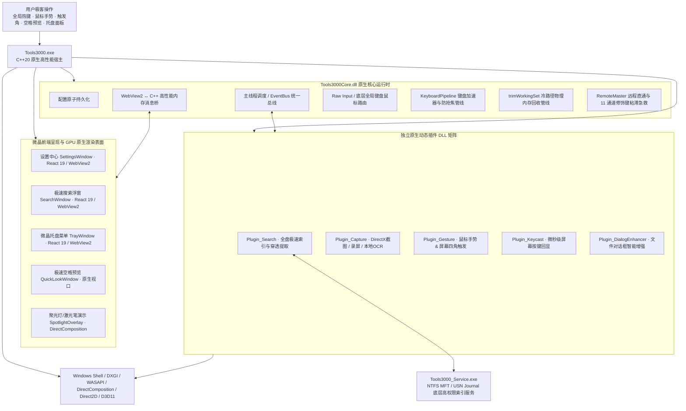

<div align="center">


# Tools3000

面向 Windows 10/11 与 Windows Server 的世界级高性能开源桌面效率工具集 (v1.0.0 官方正式版)

[简体中文](README.md) · [English](README.en.md)

[](https://github.com/yuan278501381/Tools3000/releases/latest)
[](LICENSE)
[](#system-requirements)
[](CMakeLists.txt)
[](ui/package.json)
[](ui/package.json)

</div>

Tools3000 是一款专为 Windows 平台日常办公、设计创作、开发运维与效率极客打造的**全场景高性能原生桌面工具箱**。它彻底告别了传统效率工具笨重卡顿、互相割裂、常驻吃内存的痛点，将**文件搜索、鼠标手势、触发角、截图与录屏、按键回显、鼠标演示与特效、文件对话框助手、远程协助增强**深度熔铸为一体。随叫随到，用完即走，像呼吸一样轻快自然。

---

## 🌟 核心功能一览（按客户端导航顺序）

Tools3000 每一个功能都源自对真实日常电脑使用痛点的深度洞察，完全以用户的真实操作体感为触发点：

```
┌─────────────────────────────────────────────────────────────────────────────┐
│ 01. 文件搜索        ➔ Alt+Space 瞬间呼出，全盘文件秒查，拼音盲搜与正文穿透  │
│ 02. 鼠标手势        ➔ 右键轻轻一划，后退、关网页、切桌面行云流水            │
│ 03. 触发角          ➔ 鼠标盲甩屏幕四角，一秒切桌面、锁屏息屏、多任务极速调度│
│ 04. 截图与录屏      ➔ 零黑屏磁吸截图、自愈序号、离线OCR提取与防盲录高清动图 │
│ 05. 按键回显        ➔ 屏幕角落优雅呈现按键，打字智能静默，教学演示录课神器  │
│ 06. 鼠标演示与特效  ➔ 双击 Ctrl 聚光全场，流光粒子与点击涟漪，演讲汇报利器  │
│ 07. 文件对话框助手  ➔ 消除深层目录翻找抓狂，一键直达当前打开的资源管理器目录│
│ 08. 远程协助增强    ➔ 远程桌面热键全穿透，修饰键粘滞一键急救与英文键盘脱敏  │
└─────────────────────────────────────────────────────────────────────────────┘
```

---

## 💡 用户真实体感与场景解析 (Feature Deep Dive)

### 1. ⚡ 文件搜索 (File Search)
> **“赶写汇报方案或者开会汇报时，需要找一份半年前存下的文件，甚至记不清具体全名——按下快捷键敲两三个字母，文件瞬间就出现在眼前，回车即开。”**

<p align="center">
  
</p>

- **真正眨眼即出的极速体验**：在屏幕任何地方随时按下快捷键（默认 `Alt + Space`），搜索框在屏幕中央立刻弹出，毫无迟滞感。全盘两百多万个文件，检索耗时通常仅需 1~3 毫秒，毫无等待感；
- **拼音简拼盲搜，懂你所想**：想找一份名为《2025Q3华东区销售数据汇总.xlsx》的报表，完全不需要切换中文输入法，直接打英文缩写 `hdxs` 或 `xs`，目标文件零点零几秒内直接稳居第一行，按回车直接打开；
- **深度正文穿透检索**：很多时候只记得客户方案里写了一句“年度预算缩减方案”，却完全忘了文件名叫什么。Tools3000 支持深度正文穿透检索，直接穿透查找 Word、Excel、PPT、PDF、TXT 文本乃至常用编程代码里的正文内容，遗忘在深山老林里的关键资料也能一网打尽；
- **空格秒看，不用苦等大软件**：搜到文件后，随手敲一下【空格键 (Space)】，立刻原地大图预览文档排版、图片细节或代码高亮，不需要花十几秒苦苦等待笨重的 Office 或大型设计软件漫长启动；
- **用完即走，绝不偷跑**：平时不扫描磁盘、不耗你的 CPU，只有呼出时才按需提供毫秒检索；按下 `Esc` 瞬间隐藏，丝毫不拖慢电脑速度。

---

### 2. 🖱️ 鼠标手势 (Mouse Gestures)
> **“每天查阅几十篇技术资料、看长篇资讯，手腕再也不用千百次大幅度滑动去瞄准左上角细小的‘后退’或右上角关闭按钮。”**

<p align="center">
  
</p>

- **随手一划，省时省力**：在屏幕任意地方按住鼠标右键轻轻一划——划一个“L”形直接秒关当前网页标签或窗口；向左划返回上一页，向右划前进；向下划直接最小化当前窗口；
- **桌面与任务栏滚轮联动**：在任务栏或桌面上按住鼠标右键滑动滚轮，直接丝滑切换 Windows 虚拟桌面（比如从“写代码桌面”一秒切到“沟通办公桌面”），或者平滑微调系统音量，连控制面板都不用点开；
- **聪明的手抖容错算法**：哪怕手抖画得歪歪扭扭、角度稍有偏差，它也能准确理解你的动作意图；彩色轨迹细腻平滑，随手一挥行云流水。

---

### 3. 🖥️ 触发角 (Hot Corners)
> **“像挥舞魔法棒一样随手把鼠标‘盲甩’到屏幕四角，瞬间回到纯净桌面、一秒息屏锁屏，连低头找按键的时间都省了。”**

- **盲甩屏幕角，零思考触发**：将鼠标光标随手甩向屏幕的四个物理角落（左上、右上、左下、右下），就能瞬间触发你最想要的系统动作；
- **日常办公三大王牌映射**：
  - *右上角甩一下* ➔ 瞬间隐藏所有窗口，展示清爽桌面；再甩一下瞬间还原；
  - *左下角甩一下* ➔ 瞬间锁屏息屏，离开工位去接水或洗手间前手腕随手往下一甩，电脑立刻进入锁屏保护状态，优雅防窥；
  - *左上角甩一下* ➔ 展开 Windows 多任务视图或任务中心，多开软件时一览无余；
- **智能防误触与防抖滤波**：专为日常办公调校，只有当鼠标真正坚定地推入角落短暂停留时才会激活，平时光标快速划过角落时绝不会意外误触。

---

### 4. 📸 截图与录屏 (Screen Capture & Recording)
> **“截图零黑屏卡顿、自动智能磁吸；标注序号删掉一步自动自愈；录屏带镂空呼吸指示，彻底摆脱‘不知道录没录进去’的盲录焦虑。”**

- **毫秒截图标注与专业工具**：
  - **零黑屏无感定格**：按下截图键屏幕毫无黑屏闪烁瞬间定格，鼠标移过去自动精准磁吸窗口边缘并裁切掉阴影；多层重叠窗口通过滚轮即可智能穿透切换；
  - **神级自愈序号与笔刷**：标注流程时，点一下是①、再点是②，如果中间删掉了第②步，后续的序号会自动向前递补自愈（原③自动变②），永远保持连续不跳号；画笔平滑圆润，更有荧光笔透亮高亮与高斯模糊马赛克；
  - **桌面置顶贴图**：做设计比对或抄录代码时，一键把截图钉在屏幕最顶层，支持滚轮无极缩放、半透明和贴靠屏幕边缘；
  - **本地离线文字提取 (OCR)**：对截图右键点击“提取文本”，图片里的文字毫秒级全变成可复制的文本，不联网也能用，私密文档零泄密；
  - **长网页长聊天滚动截图**：支持自动平滑滚动拼接，超长表格与聊天记录一气呵成。
- **高清录屏与防盲录指示**：
  - **桌面镂空呼吸指示框**：开始录制后，录制区域呈现一圈优雅的呼吸微光边线，框内画面原汁原味，清清楚楚知道录像边界；控制条自动吸附在选区外侧，绝不遮挡画面；
  - **点击水波圈动效**：鼠标点击时光圈自然扩散，观众一眼看懂操作重点；
  - **意外断电不坏视频**：采用工业级分片保存机制，录像中途电脑关机或程序崩溃，录好的文件依然能正常播放；一键生成色彩饱满、边缘无毛刺的高清 GIF 动图，随手发群分享。

---

### 5. ⌨️ 按键回显 (Keycast)
> **“给同事或学员远程演示、录制教学视频时，屏幕角落优雅浮现精致键帽；而在你专心写文章打字时，它又懂事地彻底隐形。”**

<table>
  <tr>
    <td width="50%" align="center">
      <br />
      <sub>全局快捷键可视化调配与冲突检测</sub>
    </td>
    <td width="50%" align="center">
      <br />
      <sub>本地按键热力图与活动趋势看板（100% 本地留存）</sub>
    </td>
  </tr>
</table>

- **高级感拉满的微晶拟态键帽**：按下快捷键时，屏幕右下角会以半透明磨砂质感浮现按键图标（如 `Ctrl + C`，连续按多次还会贴心呈现 `×3` 连击倍数），非常醒目且不遮挡主体内容；
- **聪明的上档符号折叠**：当你按下 `Shift + 8` 时，它直接显示为一个精简的 `*` 键帽，杜绝又长又累赘的冗余按键堆叠；
- **懂人性的智能打字静默**：普通码字输入一段长话时，它会自动保持安静，不频繁跳动干扰你的视线；一旦你按下了真正的功能快捷键，它立刻精准呈现；
- **纯本地绝对隐私安全**：没有云端服务器，所有输入热力图数据 100% 留存在你本地电脑，绝不上报你的任何击键内容。

---

### 6. 🪄 鼠标演示与特效 (Cursor Effects & Presentation)
> **“在会议室投屏大屏幕演讲，或远程视频会议共享桌面时，听众再也不会眯着眼睛到处找：‘鼠标现在指的是哪一行？’”**

<p align="center">
  
</p>

- **双击两下 Ctrl，全场焦点瞬间聚拢**：快速双击两下 `Ctrl` 键，周围屏幕瞬间柔和变暗，一道明亮的聚光灯光圈紧紧跟随着你的鼠标，所有人视线瞬间聚焦到你强调的细节上；
- **生动的流光轨迹与点击涟漪**：移动鼠标时拖着细腻的流光尾迹；左键点击散发清爽蓝色涟漪，右键点击散发翡翠绿色涟漪，操作节奏一目了然；
- **系统友好防打扰**：演示完毕随手晃动鼠标或按 `Esc` 优雅隐退；暗角渐变在底层巧妙避让 Windows 全屏检测，绝不会因此误触发系统的“专注助手/免打扰”模式。

---

### 7. 📁 文件对话框助手 (File Dialog Enhancer)
> **“在浏览器下载图片，或者在 Word/PS 里点击另存为，再也不用抓狂地在 C 盘、D 盘深层文件夹里一层层找来找去了！”**

- **一键直达当前正在看的文件夹**：当你触发“另存为”或“打开”弹窗时，如果旁边正开着放素材的资源管理器文件夹，对话框顶部会自动出现一个半透明微晶胶囊条。轻轻一点，弹窗立刻瞬间跳转到当前文件夹！再也不用繁琐地“复制路径 ➔ 粘贴 ➔ 回车”；
- **懂你的应用专属路径记忆**：不同软件各记各的——VS Code 另存为自动定位你的工作代码库，浏览器下载自动定位你的素材文件夹，修图软件定位相册目录，再也不会互相串台打架。

---

### 8. 🌐 远程协助增强 (Remote Assistance Boost)
> **“远程办公用向日葵、ToDesk、mstsc 连公司电脑，按 Alt+Tab 切窗口不会再误切回本机桌面；网络卡顿时修饰键粘滞一键急救，打命令自动切英文键盘。”**

- **全快捷键沉浸式直通远端**：在远程桌面窗口里操作时，按下 `Alt + Tab`、`Win + E`、`Win + R` 等系统组合键，100% 直接送达远程机器执行，不会被本机系统截胡夺焦，带来真正坐在远端电脑前的无缝沉浸操控感；
- **修饰键粘滞卡死一键急救**：远程办公最怕网络抖动丢包，远端的 `Ctrl`、`Alt` 或 `Shift` 经常像被胶水粘住一样卡死（松开手了远端还以为一直按着，随手一打字就变成快捷键关窗口）。此时只需【快速双击右侧 Ctrl 键】（或按全局急救键 `Ctrl + Alt + Backspace`），瞬间彻底冲刷释放所有卡住的键，秒级原地满血复活！
- **输入法智能脱敏**：鼠标移进远程桌面自动切换为英文键盘（`ENG 0409`），避免在 Linux 远程终端或代码行里敲命令时被中文拼音打断，移回本机无感恢复原输入法。

---

## 📊 物理内存占用横向对比 (Memory Consumption Benchmark)

Tools3000 在立项之初就坚决杜绝“为了做工具而引入巨型运行时”的资源浪费。依托现代 C++20 原生微内核与独创的冷路径退场物理工作集修剪机制（`trimWorkingSet`），Tools3000 在提供丰富强大全功能的同时，实现了难以置信的超低内存占用：

### 1. 常见效率工具与 Tools3000 内存表现横向实测对比

```
物理内存常驻占用横向对比 (越低越好)：
┌─────────────────────────────────────────────────────────────────────────────┐
│ 🔴 常见 Electron 架构效率工具 (300 MB ~ 800 MB)                            │
│    ██████████████████████████████████████████████████████████ 600 MB (典型值)│
├─────────────────────────────────────────────────────────────────────────────┤
│ 🟡 传统 C# / .NET 架构工具 (120 MB ~ 200 MB)                               │
│    ████████████████ 160 MB                                                  │
├─────────────────────────────────────────────────────────────────────────────┤
│ 🟢 Tools3000 一体化微内核 (全功能全插件并发常驻仅 20 MB ~ 40 MB)            │
│    ███ 28 MB                                                                │
├─────────────────────────────────────────────────────────────────────────────┤
│ ⚡ Tools3000 后台日常静默待机 (日常仅 ~11 MB，CPU 占用 0.0%)               │
│    █ 11 MB                                                                  │
└─────────────────────────────────────────────────────────────────────────────┘
```

| 软件类别与技术方案 | 日常待机物理内存 | 重度使用峰值 | 任务退场恢复速度 | 资源开销根因分析 |
| :--- | :---: | :---: | :---: | :--- |
| **Electron 架构启动器/工具箱** | **300 MB ~ 500 MB** | 800 MB ~ 1.5 GB | 无法有效归还 (V8堆常驻) | 哪怕只画一个输入框，也会拉起庞大的 Chromium 渲染引擎与 Node.js 运行时，内存居高不下。 |
| **传统 C# / .NET 桌面工具** | **120 MB ~ 180 MB** | 300 MB ~ 500 MB | 缓慢等待 GC 周期回收 | 依赖 .NET CLR 运行时托管堆与垃圾收集器，易产生微卡顿与内存波动。 |
| **Tools3000 (C++20 原生微内核)** | **`~11 MB`** | **`20 ~ 40 MB`** | **`< 0.5 秒` 极速收缩** | 原生零运行时开销，完成截图/录屏/OCR 等任务后秒级将内存归还系统工作集，静默时待机 CPU 恒为 0.0%。 |

> 💡 **冷路径退场内存修剪说明**：全盘搜索服务常驻全机 250 万文件的紧凑索引拓扑树时仅需约 280MB（均摊仅 119 字节/文件），且遵循 `DEMAND_START` 契约——开机绝不自启，仅在用户首次显式呼出搜索时拉起并在当前会话常驻；截图、录屏与 OCR 等重型任务结束后，0.5 秒内自动释放缓冲区，让出宝贵的系统内存给专业生产力软件。

---

## 🏗️ 极客硬核技术栈与微内核架构 (Tech Stack & Architecture)

对于关注底层工程实现与极客性能的用户，Tools3000 的底层拓扑设计秉承高内聚、低耦合的世界级系统工程规范：



### 硬核技术亮点：
1. **现代 C++20 原生内核**：全代码库采用现代 C++20 编写，享受强类型系统、概念约束与现代并发设施带来的坚固鲁棒性，彻底消除垃圾回收（GC）引起的任何微掉帧与丢字；
2. **Win32 底层输入管线与加速器拦截**：基于 `WH_KEYBOARD_LL`、`WH_MOUSE_LL` 与 Raw Input 实现纳秒级输入处理；挂载 `KeyboardPipeline` 拦截 `SC_KEYMENU` 与 `WM_HELP`，并屏蔽 Chromium 浏览器默认热键冲突，确保热键毫秒直达；
3. **全链路 GPU 硬件加速渲染**：手势轨迹、聚光灯与按键回显全面采用 DirectComposition、Direct2D、DirectWrite 与 Direct3D 11 硬件加速合成；手势采用局部 100~300px 最小包围盒微视口，点击涟漪采用 256 阶 LUT 查表（0-sqrt 优化），渲染丢帧率 0.00%；
4. **WebView2 现代渲染解耦与自动休眠**：界面交互基于 React 19、TypeScript 与 Tailwind 打造细腻的微晶磨砂玻璃视觉；面板关闭或闲置 60 秒后自动挂载 `TrySuspend()` 冻结 JS 堆乃至回收渲染子进程，完美兼顾界面颜值与原生性能；
5. **微内核插件化拓扑**：主程序与各个功能模块严格遵循物理隔离，全部拆解为独立的 C++ 动态链接库（`Plugin_*.dll`），由 `Tools3000Core` 核心事件总线统筹调度，高内聚、低耦合；
6. **可信本地 Lua 自动化扩展**：内置轻量级 Lua 引擎作为宿主授权的可信本地扩展通道，支持编写自定义脚本联动系统 API 与桌面自动化能力；
7. **x64 与 ARM64 双架构原生兼容**：原生支持 Intel/AMD 64 位芯片与 Surface Pro / 高通骁龙 Windows on ARM 设备，构建系统独立物理隔离校验，保障原生便携分发。

---

<a id="system-requirements"></a>
## 💻 系统要求与跨架构兼容

- **操作系统**：Windows 10 (1809 及以上) / Windows 11 / Windows Server 2019 / 2022 / 2025 全系列；
- **指令集架构**：原生支持 **x64** (Intel / AMD) 与 **ARM64** (Surface Pro / 高通骁龙 Windows 终端)；
- **运行环境**：Microsoft Edge WebView2 Runtime（Windows 10/11 绝大多数系统已内置，缺失时自动提示安装）；
- **显卡支持**：支持 DirectX 11 / Direct2D 硬件加速显卡；录屏支持 NVENC / QSV / AMF / CPU 多引擎自适应加速。

---

## 📥 下载与安装 (Downloads)

| 文件名称 | 适用架构与平台 | 说明 |
| :--- | :--- | :--- |
| **`Tools3000-Setup.exe`** | Windows 10/11/Server (x64) | 官方推荐标准安装包（开箱即用，支持自启动与服务集成） |
| **`Tools3000-v1.0.0-Setup.exe`** | Windows 10/11/Server (x64) | 带明确版本号的正式归档安装包 |
| **`Tools3000-v1.0.0-win-x64-portable.zip`** | Windows 10/11/Server (x64) | 绿色免安装便携版（解压即用，所有配置 100% 本地留存） |
| **`SHA256SUMS.txt`** | 全平台产物 | 官方发布二进制文件的 SHA-256 完整性校验哈希值清单 |

> 💡 **常用快捷键一览**：
> 1. 呼出搜索中心：默认 **`Alt + Space`**；
> 2. 空格极速预览：文件管理器中选中文件按 **`Space`**（空格键）；
> 3. 双击开启聚光灯：快速连击两下 **`Ctrl`**；
> 4. 远程按键急救：快速双击右侧 **`Ctrl`** 或按下 **`Ctrl + Alt + Backspace`**；
> 5. 所有快捷键与手势轨迹均可在设置中心自由个性化修改与实时冲突检测。

---

## 🔒 隐私与本地可信安全 (Privacy First)

- **100% 本地运行**：文件索引、离线文字识别 OCR、键盘统计、截图标注与屏幕录像所有数据均只保存在你的本地硬盘与内存中；
- **零联网上报**：不设立云端账户，不采集任何击键日志，不上传任何隐私数据，断网状态下所有核心功能 100% 正常运行；
- **本地可信扩展**：内置 Lua 引擎定位为宿主授予的可信本地扩展通道，进程间通信采用强随机令牌双重隔离校验，坚如磐石。

---

## 🛠️ 从源码构建 (Build from Source)

### 环境依赖
- Windows 10/11 或 Windows Server (x64 / ARM64)
- Visual Studio 2022 (安装“使用 C++ 的桌面开发”工作负载，支持 MSVC v143)
- CMake 3.25+
- PowerShell 7+ (`pwsh`)
- Git 2.40+
- Node.js 20+

### 一键部署与编译运行
```powershell
# 1. 克隆代码仓库
git clone https://github.com/yuan278501381/Tools3000.git
cd Tools3000

# 2. 一键安装依赖、编译 C++ 原生微内核与前端产物并运行全套测试门禁
pwsh deploy.ps1
```

编译完成后，纯净的可执行文件与绿色便携版将自动生成至 `deploy_dist` 目录，标准已签名安装程序位于 `Output\Tools3000-Setup.exe`。

---

## 🤝 开发者与进阶文档

- 📋 [Tools3000 v1.0.0 官方正式版发布说明 (Release Notes)](docs/RELEASE_NOTES_v1.0.0.md)
- 🚀 [极致内存收缩与性能调优实录 (Performance Tuning)](docs/performance-tuning.md)
- 📏 [性能基线采集与可重复协议 (Performance Baseline)](docs/performance-baseline.md)
- 🧩 [C++ 原生动态插件开发指南 (Plugin Development)](docs/plugin-development.md)
- 📜 [Lua 扩展脚本 API 参考手册 (Lua API Reference)](docs/api/lua-api.md)
- 🏷️ [版本号管理与发布流水线规范 (Versioning Guide)](docs/versioning.md)
- 🔐 [Authenticode 自动化数字签名规范 (Release Signing)](docs/release-signing.md)

---

## 📄 开源许可证与作者署名

本项目遵循 **[MIT License](LICENSE)** 开源协议。

* **项目作者**：**`Yy1 (yuan278501381)`**（GitHub：[@yuan278501381](https://github.com/yuan278501381)）
* **项目仓库**：[https://github.com/yuan278501381/Tools3000](https://github.com/yuan278501381/Tools3000)
* **法定版权**：`Copyright (c) 2026 Yy1 (yuan278501381) & Tools3000 contributors`
