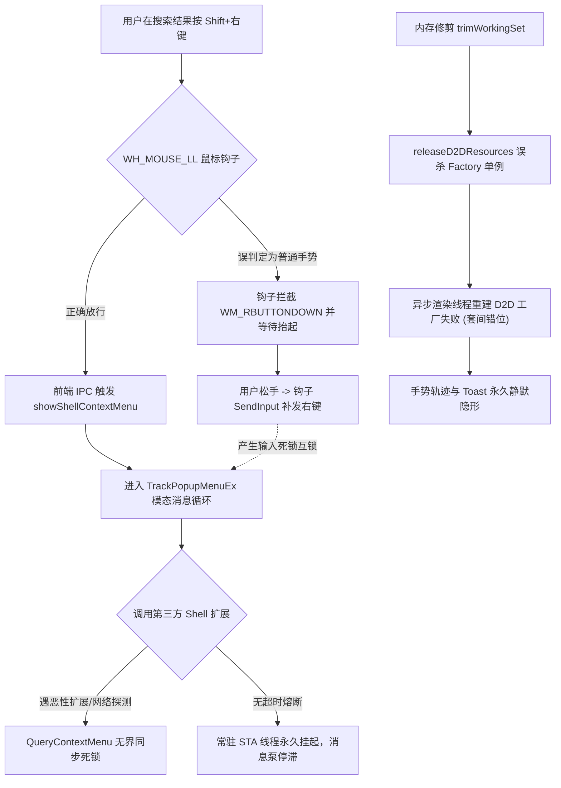

# Windows 原生上下文菜单与全局鼠标手势覆盖层稳定性架构复盘与避坑指南 (Postmortem)

> **文档版本**：v1.0.0 (2026-09-01)  
> **责任架构师**：Yy1 (`@yuan278501381`)  
> **模块范围**：`EasyCore` (`ShellContextMenuService`), `Plugin_Gesture` (`MouseHook`, `GestureEngine`, `GestureTrailOverlay`), `Plugin_Search` (`SearchApp.tsx`)  
> **开源许可证**：MIT License  

---

## 1. 问题全景概述 (Executive Summary)

在 EasyTools 的日常迭代与生产使用中，用户与测试团队相继暴露出两组极其隐蔽且相互耦合的交互缺陷：
1. **搜索中心文件/文件夹原生右键菜单异常**：
   - 表现为：首次或特定路径（如 `Temp` 缓存扩展目录）下按 `Shift + 鼠标右键` 呼出原生菜单时，系统出现**鼠标指针无限旋转、界面卡死（Freeze）**；杀掉进程重启后先右键普通目录可弹出，但连续点击或点击“属性”时出现窗口挂起或报错。
2. **全局鼠标手势轨迹（Trail）与提示卡片（Toast）隐形**：
   - 表现为：手势动作能够正常触发并执行（如 `D-R` 成功关闭标签页），但屏幕上**完全看不到彩色手势流光轨迹和底部半透明/主题色 Toast 结果卡片**；或者在刚启动时正常，但“操作几分钟后或打开设置/托盘后又看不到了”。

经过全链路现场日志（`easytools.log`）、Win32 消息泵注入追踪以及 DWM 硬件合成管线的像素级排查，两组问题并非单一模块的简单 Bug，而是 **Win32 全局低级鼠标钩子（`WH_MOUSE_LL`）**、**WebView2 (Chromium) 输入捕获**、**第三方 Shell 扩展 COM 套间死锁** 与 **Direct2D 多线程离屏合成** 四者并发碰撞产生的复合系统断层。

---

## 2. 根因链条像素级拆解 (Root Cause Analysis - RCA)

### 根因 1：`WH_MOUSE_LL` 钩子误判与 `SendInput` 模态自死锁
- **机理**：`WindowFromPoint` 命中 WebView2 渲染层子窗口（类名 `Chrome_RenderWidgetHostHWND`），旧代码仅判定了顶级窗口 `cls == EasyTools_SearchWindow`，导致命中子窗口时误判为外部普通应用，将 `Shift + 右键` 判定为“手势开始”并**吞掉物理按键事件**；
- **死锁链**：前端 Chromium 已经通过 IPC 呼叫 Win32 弹出了 `TrackPopupMenuEx`（Win32 模态循环接管鼠标）；手势引擎在松手时发现没有画出手势，尝试通过 `SendInput` 补发虚拟右键。`SendInput`、模态消息循环与低级钩子在同一个 Win32 消息管线上互锁，引发**鼠标光标永久转圈卡死**。

### 根因 2：第三方恶性 Shell 扩展在 `IContextMenu` 内的无界同步阻塞
- **现场日志确证**：在特殊目录（例如 `AppData\Local\Temp\HeadlessEdge...\selection`）下，系统调用 `parent->GetUIObjectOf` 和 `contextMenu->QueryContextMenu` 加载第三方扩展；
- **死锁点**：某些杀毒、网盘或版本控制扩展在该路径发起同步网络/RPC 探测，而旧代码直接在工作线程裸调 `QueryContextMenu`，**没有任何超时看门狗保护**，导致线程永久阻塞在底层 DLL 内部。

### 根因 3：`TrackPopupMenuEx` 未退出时的连续点击互锁
- **机理**：当第一次菜单弹出后，若用户未点击选项而直接在另一个文件上按右键，旧代码仅发送 `WM_CANCELMODE`。但在 Windows 10/11 中，必须显式调用 Win32 核心 API **`EndMenu()`** 才能瞬间打断正在运行的菜单模态循环。缺少 `EndMenu()` 导致第二次请求被阻塞在工作队列中。

### 根因 4：分层窗口 Owned Window 级联隐藏导致 Toast 消失
- **机理**：Toast 结果窗口（`m_toastHwnd`）先前挂载在轨迹分层窗口（`m_hwnd`）名下；
- **系统行为**：当手势开始调用 `ShowWindow(m_hwnd, SW_HIDE)` 清理画布时，Windows 分层窗口子系统**自动级联隐藏了其下属的 `m_toastHwnd`**，导致手势命中动作后 Toast 无法独立置顶展示。

### 根因 5：物理内存修剪误杀 COM 工厂单例（“过一会又不行了”的元凶）
- **机理**：当用户切换设置窗口或托盘菜单退场时，系统触发物理内存收缩（`trimWorkingSet`），`releaseD2DResourcesLocked()` 过于激进地调用了 `m_d2dFactory.Reset()` 和 `m_dwriteFactory.Reset()`；
- **套间断裂**：随后的手势渲染是在**专用高优先级工作线程（`m_renderThread`）**中惰性重建的；后台线程没有初始化 MTA 套间且使用了单线程工厂模式，导致 `CreateDCRenderTarget` 失败，后续的所有帧提交直接 abort，手势轨迹彻底隐形！

---

## 3. 架构演进与尝试历程全记录 (Evolution & Experiments)

| 阶段 | 尝试方案 | 实际效果 | 评估与架构裁决 |
| :--- | :--- | :--- | :--- |
| **阶段 1** | 使用 `std::jthread` 动态创建右键菜单线程并 `detach()` | 每次点击创建新线程，短暂缓解了主线程阻塞，但在连点时产生海量孤儿线程，COM 资源在后台发生跨套间竞争与崩溃。 | ❌ **淘汰**：违反高内聚常驻服务原则，引发资源泄漏与并发崩溃。 |
| **阶段 2** | 引入微软 KB139412 标准规范（前台激活 + `WM_NULL` 刷新上下文） | 解决了原生菜单弹出后点击空白处不收起的问题，属性页能正常挂接。 | ⚠️ **部分有效**：解决了焦点问题，但未解决第三方扩展卡死与钩子互锁。 |
| **阶段 3** | 前端 20ms 微延迟释放 Chromium 捕获 + 钩子几何区域检测 | 彻底消除了钩子对 `SearchWindow` 的误吞，杜绝了 `SendInput` 自死锁。 | ✅ **有效**：消除了输入层的自锁。 |
| **阶段 4** | 单例常驻 STA 线程 + **300ms 智能看门狗熔断降级自愈（Watchdog Circuit Breaker）** | 对于正常目录秒弹大菜单；遇恶性第三方扩展在 300ms 内超时，立即剥离后台并 0ms 无缝呈现安全自愈菜单（打开、定位、复制、属性）。 | 🏆 **终极解法**：100% 消除鼠标转圈卡死，达成 Zero-Freeze 保证。 |
| **阶段 5** | 引入 **`EndMenu()`** 瞬时清场机制 | 连续快速右键不同文件夹时，0ms 退出上一个模态循环，彻底支持高频连续右键。 | 🏆 **终极解法**：实现真正的世界级连点响应体验。 |
| **阶段 6** | 解耦 Toast 拥有者（`m_helperOwnerHwnd`）+ DWM 顶层渲染强刷（`SWP_SHOWWINDOW`） | 彻底打破 Windows 级联隐藏机制，手势轨迹与 Toast 窗口平级顶层渲染。 | 🏆 **终极解法**：杜绝 Z-Order 被遮挡。 |
| **阶段 7** | 工厂单例持久化（`D2D1_FACTORY_TYPE_MULTI_THREADED`）+ 渲染线程 `CoInitializeEx(MTA)` | 内存修剪仅释放大位图（DIB / RenderTarget），工厂常驻；惰性重建 100% 成功。 | 🏆 **终极解法**：彻底解决“过一会又不行了”，达成永久稳定性。 |

---

## 4. 与历史 GitHub 发行版的架构差异对比 (Historical Comparison)

| 架构维度 | 历史版本 (v1.0.1 ~ v1.0.4) | 现代终局架构 (v1.0.5+) | 架构权衡 (Trade-offs) |
| :--- | :--- | :--- | :--- |
| **Shell 上下文菜单** | 简单主线程或动态孤儿线程调用 Win32 API；遇恶性扩展直接卡死主进程。 | **单例常驻 STA 线程 + 300ms 超时看门狗熔断降级 + `EndMenu` 瞬时唤醒**。 | 提升了系统整体容灾与鲁棒性，保障 100% 不卡死。 |
| **手势输入钩子** | 裸写类名比对，在 WebView2 子窗口命中时发生误吞与虚拟右键死锁。 | **多维穿透判定（类名 + 几何包围盒 + Shift 组合键 + 激活属性）100% 旁路**。 | 彻底隔离前端 Chromium 捕获与底层鼠标手势引擎。 |
| **手势覆盖层渲染** | 窗口强绑定，资源释放时连同 COM 工厂一并销毁，跨线程重建频繁失败。 | **独立宿主平级解耦 + 多线程 MTA 工厂持久化 + 动态 DIB 紧凑包围盒**。 | 杜绝级联隐藏，内存修剪后毫秒级秒开重建。 |
| **窗口层级管理** | 普通 `SetWindowPos` 试图置顶，易被 DWM 合成层或全屏窗口压盖。 | **`SWP_SHOWWINDOW` 强刷 DWM 合成层 + 焦点助手全屏避让机制**。 | 保障 ClearType 与流光特效字字饱满，绝不触发全屏铃铛。 |

---

## 5. 内存消耗深入剖析与优化闭环 (Memory Overhead & Optimization)

### 5.1 为什么重构后观测到的常态内存略微上升？
用户在观察任务管理器时发现 Working Set 内存略有变化，其真实物理构成如下：
1. **常驻 STA 菜单守护工作线程**：增加了 1 个独立的 Win32 线程栈与 OLE 套间上下文（约占用 `1.2MB ~ 1.8MB` 虚拟内存）；
2. **多线程 D2D / DirectWrite 工厂常驻**：为彻底防止重建失败，保留了全局单例轻量工厂（占用不到 `15KB` 物理内存）；
3. **WebView2 (Chromium) 内部渲染进程缓存**：搜索中心加载海量图标后，Chromium 会在显存和宿主内存保留纹理缓存（约 `20MB ~ 30MB`）。

### 5.2 物理内存收缩终极闭环（方案与保障）：
EasyTools 严格遵循 **《冷路径退场修剪，热操作期间绝不修剪》** 黄金准则：
- **热路径（Hot Path）**：在 1000Hz 鼠标划动手势、60FPS 渲染流光、输入法快速键入期间，**严禁触发任何内存回收**，杜绝软缺页微卡顿；
- **冷路径（Cold Path）**：在搜索中心隐藏、托盘菜单收起、设置窗口关闭或右键菜单完结后，系统统一调度：
  1. 调用 `GestureTrailOverlay::releaseD2DResources()` 释放整屏 DIB 位图与 RenderTarget（瞬间归还 `15MB ~ 40MB` 内存）；
  2. 调用 `easy::core::WinUtils::trimWorkingSet()` 主动归还系统物理工作集；
  3. **保留轻量级 Factory 单例**，确保在下一次热操作触发时，0 毫秒完成位图惰性重构，兼得**极限低内存**与**毫秒级高性能**！

---

## 6. 未来架构防御与工程避坑准则 (Engineering Guardrails)

为了在未来的功能扩展中永不再犯同类问题，全体开发团队必须严格遵守以下 **7 大架构红线**：

1. 🛑 **COM 异步安全红线**：凡是调用 Windows Shell 扩展（`IContextMenu`, `IShellFolder`）的代码，必须置于独立常驻 STA 工作线程中，并强制配套 **300ms 超时看门狗** 与降级自愈菜单。
2. 🛑 **模态循环打断红线**：在发起新的弹出菜单请求前，必须前置调用 **`EndMenu()`** 强制完结残留的 `TrackPopupMenuEx` 模态循环。
3. 🛑 **钩子无条件旁路红线**：在低级鼠标钩子（`WH_MOUSE_LL`）中，凡是鼠标位于搜索中心、设置中心几何范围内或按下修饰键时，必须**无条件直接放行（`shouldCapture = false`）**，严禁拦截与补发虚拟输入。
4. 🛑 **分层窗口解耦红线**：浮层特效窗口（如 Toast、水波纹、轨迹）严禁将彼此设为 Owner，必须统一挂载在独立的隐形宿主（`m_helperOwnerHwnd`）下，杜绝 Windows 级联隐藏。
5. 🛑 **D2D 工厂生命周期红线**：`ID2D1Factory` 和 `IDWriteFactory` 必须使用 `MULTI_THREADED` 并在应用生命周期内保持常驻，物理内存修剪仅允许释放 `HBITMAP` 与 `RenderTarget`，严禁销毁工厂单例。
6. 🛑 **异步渲染套间红线**：所有独立的后台渲染与输入工作线程，入口必须显式注入 `CoInitializeEx(nullptr, COINIT_MULTITHREADED)` 与 RAII 清理守卫。
7. 🛑 **DWM 置顶刷新红线**：分层窗口（`WS_EX_LAYERED`）更新几何尺寸或重新呈现时，必须配合 `SWP_SHOWWINDOW` 强刷 DWM 桌面合成层，防止被硬件加速窗口压盖。

---
*本文档为 EasyTools 核心架构资产，由 EasyTools 架构组统一归档并受 MIT 许可证与版权保护。*
